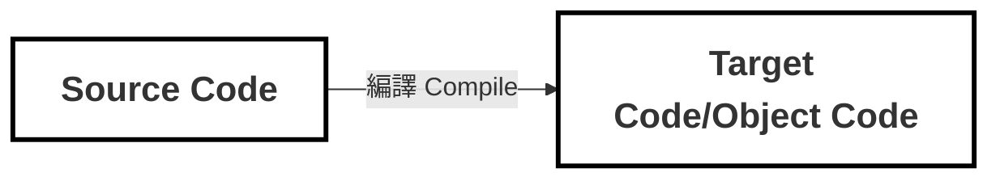

# 15.1 模板 DSL 的編譯器
學習重點：
- 了解什麼是編譯器
- 了解編譯流程
- AST (Abstract Syntax Tree) 抽象語法樹的特性

---
transition: slide-up
level: 2
---

## 編譯器 Compiler
廣義的 Compiler ，其實就是把一種語言（source code）轉換成另一種語言（target code）的橋樑



---
transition: slide-up
level: 2
---

## 編譯過程


編譯後端不一定會包含「中間程式碼生成」和「最佳化」這兩個環節，這取決於特定的場景和實作。這兩個環節有時也叫做「中端」。


<!--
編譯前端：僅負責原始碼分析
編譯後端：通常負責生成目標程式碼
-->

---
layout: two-cols-header
---

## DSL (Domain-Specific Language) : 領域特定語言

::left::


::right::
DSL: 專門為「特定領域」、「特定任務」而設計的語言，設計 DSL 的過程通常會牽涉到編譯技術

Vue.js 模板和 JSX 就是 DSL。而 Vue.js 模板編譯器的目標程式碼就是「渲染函式」


<style>
.two-cols-header {
  column-gap: 20px; 
}
</style>

---
transition: slide-up
level: 2
---

### Vue.js 模板編譯器的工作流程


1. Vue.js 模板編譯器會先對模板進行詞法分析和語法分析，獲得模板 AST
2. 透過「轉換器」，將模板 AST 轉成 JavaScript AST
3. 最後，根據 JavaScript AST 產生 JavaScript 程式碼，即渲染函數(目標程式碼)


<blockquote class="text-xl">
<b>AST (Abstract syntax tree) 抽象語法樹 是什麼？</b>

把原始碼的語法結構以樹狀的形式呈現，隱藏了真實語法細節

樹上的每個節點都表示原始碼中的一種結構，**模板 AST 其實就是用來描述模板的抽象語法樹**
</blockquote>


<!-- AST 是一種資料結構，如果你把程式碼想像成一段文字，那 AST 就是這段文字的骨架 -->

---
layout: two-cols
layoutClass: gap-5
---

範例：

::left::

```html {*}{lines:true}
<div>
  <h1 v-if="ok">Vue Template</h1>
</div>
```
<div v-click="1">這段模板被編譯成 AST 後 →</div>

::right::

<div v-click="1">

```js {*}{lines:true}
const ast = {
  type: 'Root',
  children: [
    {
      type: 'Element',
      tag: 'div',  // <div> 節點
      children: [
        {
          type: 'Element',
          tag: 'h1',   // <h1> 節點
          props: [
            // v-if 指令節點
            {
              type: 'Directive', // type 為 Directive 代表指令
              name: 'if',        // 指令名稱為 if，不帶有前綴 v-
              exp: {
                type: 'Expression', // 表達式節點
                content: 'ok'
              }
            }
          ]
        }
      ]
    }
  ]
}
```
</div>


<!--
AST 其實就是一個有層級結構的物件

Root: 代表整個模板內容的容器
-->

---
transition: slide-up
level: 2
---


💡 AST 小結論
<v-clicks>

1. 不同類型的節點是透過 type 屬性進行區分。例如「標籤」節點的 type 值為 `Element`
2. 標籤節點的子節點儲存在其 children 陣列中
3. 標籤節點上的「屬性節點」和「指令節點」會儲存在 props 陣列中
4. 不同類型的節點會使用不同的物件屬性來描述。例如「指令節點」擁有 `name` 屬性，表達指令的名稱，而「表達式」節點擁有 `content` 屬性，用來描述表達式的內容

</v-clicks>

---
layout: two-cols
layoutClass: gap-4
---

::left::
<div class="text-sm">

透過 `parse` 函式來完成對模板的「詞法分析」和「語法分析」


透過 `transform` 函式，將模板 AST 轉成 JavaScript AST


透過 `generate` 函式，將 JS AST 生成為 JS Code


</div>
::right::
<br />
<br />

```vue {*}{lines:true}
const template = `
  <div>
    <h1 v-if="ok">Vue Template</h1>
  </div>
`
```

```js {*}{lines:true}
const templateAST = parse(template)
const jsAST = transform(templateAST)
const code = generate(jsAST)
```

---
transition: slide-up
level: 2
---


## 補充：詞法分析 V.S 語法分析

|  | 詞法分析 (Lexical Analysis) | 語法分析 (Syntax Analysis) |
| --- | --- | --- |
| **別名** | 掃描 (Scanning) | 解析 (Parsing)
| **輸入** | String | Token 列表 |
| **輸出** | Token 列表 (扁平的) | AST 語法樹 (有層級的) |
| **主要工作** | 切分字元、去除無意義資訊（空白/註解）、辨識基本詞彙 | 依語法規則把 token 組成結構、處理優先序/結合性 |
| **比喻** | 在字典裡查每一個單字的意思 | 分析句子的主詞、動詞、受詞結構 |
| **例子** | `v-if="ok"` → `Identifier(v)` `Punctuator(-)` `Identifier(if)` ... | `Element(h1)` 搭配 `Directive(if)` 組成 AST 節點 |

<!--
Parse 階段其實包含兩個子步驟：詞法分析和語法分析。這兩個步驟的分工很明確，用這張表來看一下。
首先是「別名」：詞法分析也叫掃描（Scanning），語法分析也叫解析（Parsing）。所以有時候看到「Parse」這個詞，要注意它有兩種意思：狹義的是指「語法分析」這個步驟，廣義的是指整個「解析階段」，包含詞法和語法兩個步驟

接著看「輸入和輸出」：詞法分析的輸入是原始的字串，像是 `<div>Hello</div>` 這樣的模板字串，輸出是一個扁平的 Token 列表。然後語法分析接手，它的輸入就是這些 tokens，輸出則是有層級結構的 AST 語法樹

「主要工作」方面：詞法分析負責把字串切分成有意義的小單位，像是標籤名稱、屬性、文本等等，並且會去除掉空白、註解這些無意義的資訊。語法分析則是根據語法規則，把這些 tokens 組合成有結構的樹狀資料

用一個比喻來理解：詞法分析就像在字典裡查每一個單字的意思，把句子拆解成一個個認識的詞彙；語法分析則是分析整個句子的文法結構，找出主詞、動詞、受詞之間的關係

最後看「例子」：假設我們有 `v-if="ok"` 這個指令，詞法分析會把它切成 `v`（識別符）、`-`（標點符號）、`if`（識別符）、`=`、`"ok"` 這些小單位

語法分析會理解這整體是一個 v-if 指令，並建立一個 Directive 節點

-->

---
transition: slide-up
level: 2
---

全貌：


<v-clicks>
<div>
  <p>💡 小結論</p>
  1. parse: 詞法＋語法分析

  2. transform: AST 的轉換 (模板 → JS)

  3. generate: 將 JS AST 生成為 JS Code
</div>
</v-clicks>
