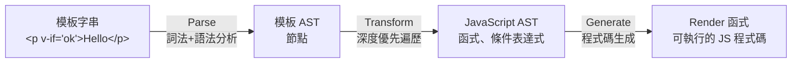

# 牛刀小試

<div class="grid grid-cols-2 gap-2 text-sm mt-4">

<div class="p-4 bg-blue-500/10 border border-blue-500/30 rounded-lg">
<div class="font-bold text-blue-400 mb-2">Q1. 編譯器基礎概念</div>
<div>Vue 模板是一個 DSL，為什麼它不需要圖靈完備？</div>
</div>

<div class="p-4 bg-green-500/10 border border-green-500/30 rounded-lg">
<div class="font-bold text-green-400 mb-2">Q2. 有限狀態自動機</div>
<div>在解析 <code>&lt;div&gt;Vue&lt;/div&gt;</code> 時，狀態機 會經過哪些狀態？</div>
</div>

<div class="p-4 bg-purple-500/10 border border-purple-500/30 rounded-lg">
<div class="font-bold text-purple-400 mb-2">Q3. AST 建構過程</div>
<div>解釋 <code>elementStack</code> 在建構 AST 時的用途，並說明遇到「開始標籤」與「結束標籤」時，堆疊會如何變化？</div>
</div>

<div class="p-4 bg-orange-500/10 border border-orange-500/30 rounded-lg">
<div class="font-bold text-orange-400 mb-2">Q4. 節點訪問與轉換</div>
<div>為什麼需要將「節點操作」與「節點訪問」解耦？使用回調函式機制來解耦有什麼好處嗎？</div>
</div>

<div class="p-4 bg-cyan-500/10 border border-cyan-500/30 rounded-lg">
<div class="font-bold text-cyan-400 mb-2">Q5. 進入與退出時機</div>
<div>在遍歷 AST 節點時，為什麼需要區分「進入節點」與「退出節點」兩個時機？</div>
</div>

<div class="p-4 bg-pink-500/10 border border-pink-500/30 rounded-lg">
<div class="font-bold text-pink-400 mb-2">Q6. 轉換上下文</div>
<div>轉換上下文（context）物件通常會包含哪些資訊？為什麼需要在轉換過程中傳遞上下文？</div>
</div>

<div class="p-4 bg-yellow-500/10 border border-yellow-500/30 rounded-lg">
<div class="font-bold text-yellow-400 mb-2">Q7. 整合應用</div>
<div>請描述 Vue 模板 <code>&lt;p v-if="ok"&gt;Hello&lt;/p&gt;</code> 從模板字串到最終 render 函數的完整編譯流程（parse → transform → generate）。</div>
</div>
</div>


---
transition: slide-up
level: 2
---

# 答案 Q1：編譯器基礎概念

問題：Vue 模板是一個 DSL，為什麼它不需要圖靈完備？

<div class="grid grid-cols-2 gap-6 mt-4">
<div>


**DSL（領域特定語言）**
- 不要求圖靈完備
- 只需要滿足特定場景下的特定用途
- 例如：Vue 模板、HTML、CSS

</div>
<div>

**Vue 模板不需要圖靈完備的原因：**
- Vue 模板的目的是描述「UI 結構、資料綁定、指令」等
- 不需要表達複雜的演算法邏輯
- 模板語法固定、結構簡單，更容易解析和優化
- 複雜邏輯應該寫在 JavaScript 中，模板只負責 UI

</div>
</div>


---
transition: slide-up
level: 2
---

# 答案 Q2：有限狀態自動機

問題： 在解析 `<div>Vue</div>` 時，狀態機 會經過哪些狀態？


<div class="grid grid-cols-2 gap-6 mt-4">
<div>

**狀態轉換流程：**

<v-clicks>

1. **initial（初始狀態）** → 遇到 `<`
2. **tagOpen（標籤開始）** → 遇到字母 `d`
3. **tagName（標籤名稱）** → 讀取 `div`，遇到 `>`
4. **initial（初始狀態）** → 遇到字母 `V`
5. **text（文本狀態）** → 讀取 `Vue`，遇到 `<`
6. **tagOpen（標籤開始）** → 遇到 `/`
7. **tagEnd（結束標籤）** → 遇到字母 `d`
8. **tagEndName（結束標籤名稱）** → 讀取 `div`，遇到 `>`
9. **initial（初始狀態）** → 解析完成

</v-clicks>

</div>
<div>

</div>
</div>


---
transition: slide-up
level: 2
---

# 答案 Q3：AST 建構過程

問題： 解釋 `elementStack` 在建構 AST 時的用途，並說明遇到「開始標籤」與「結束標籤」時，堆疊會如何變化？

<div class="text-sm">
<div class="mt-2">

**elementStack 的用途**：維護元素間的父子關係

<div class="grid grid-cols-2 gap-2 mt-2">
  <div>

  **遇到開始標籤（如 `<div>`）：**
  - 建立一個新的 Element 類型 AST 節點
  - 將該節點 **push** 進堆疊
  - 該節點成為新的棧頂（當前父節點）

  **遇到結束標籤（如 `</div>`）：**
  - 將當前棧頂節點 **pop** 出堆疊
  - 表示該元素的子節點已全部處理完畢
  - 棧頂回到上一層的父節點

  </div>
<div>

範例：`<div><p>Vue</p></div>`

```text
初始：[Root]
<div>：[Root, div]
<p>：[Root, div, p]
Vue：[Root, div, p]（不改變堆疊，Vue 加入 p 的 children）
</p>：[Root, div]（p pop 出去）
</div>：[Root]（div pop 出去）
```

</div>
</div>
</div>
</div>


---
transition: slide-up
level: 2
---

# 答案 Q4：節點訪問與轉換

問題：為什麼需要將「節點操作」與「節點訪問」解耦？使用回調函式機制來解耦有什麼好處嗎？
<div>


<div class="grid grid-cols-2 gap-4 mt-3">
<div>

**需要解耦的原因：**
<div class="p-4 bg-blue-500/10 border-l-4 border-blue-500 rounded-r-lg my-3 shadow-sm text-sm">
如果將所有操作寫在 traverseNode 函式中，隨著功能增加會變得越來越臃腫，導致難以維護和擴展，違反單一職責原則
</div>

**使用回調函數機制的優勢：**

1. 關注點分離：
- `traverseNode`：負責「遍歷」（深度優先）
- 回調函式：負責「操作」（轉換邏輯）

<hr class="m-5" />

2. 可擴展和維護性：
- 可以加入新的轉換函式，不需要修改遍歷邏輯，形成轉換插件系統（plugin architecture）
</div>

<div class="mt-[180px]">
3. 可測試性：

- 遍歷邏輯和轉換邏輯可以分別測試
</div>
<div>
</div>
</div>
</div>


---
transition: slide-up
level: 2
---

# 答案 Q5：進入與退出時機

問題： 在遍歷 AST 節點時，為什麼需要區分「進入階段」與「退出階段」兩個時機？

<br />

**為什麼需要區分兩個時機？**

因為在 AST 轉換過程中，有些操作需要先處理父節點（自上而下），有些操作則需要先處理子節點（自下而上），如果只有一個時機，就無法靈活處理這兩種不同的轉換需求。

- **進入階段**：先進入父節點，再進入子節點。可以在進入階段處理父節點的資訊，為子節點的處理上提供上下文
- **退出階段**：先退出子節點，再退出父節點。可以在退出階段根據子節點的處理結果來決定父節點的轉換


---
transition: slide-up
level: 2
---

# 答案 Q6：轉換上下文

問題：轉換上下文（context）物件通常會包含哪些資訊？為什麼需要在轉換過程中傳遞上下文？
<div class="grid grid-cols-2 gap-4 mt-3">
<div>

**上下文通常包含的資訊：**

**1. 當前節點資訊：**
- `currentNode`：當前正在處理的節點
- `parent`：父節點引用
- `childIndex`：在父節點中的索引

**2. 轉換配置：**
- `nodeTransforms`：節點轉換函數陣列

**3. 操作函式：** 例如 `replaceNode(node)`、`removeNode()`


</div>
<div>

**為什麼需要傳遞上下文：**

<div class="p-3 bg-purple-500/10 border-2 border-purple-500/30 rounded-lg">

因為在 AST 轉換過程中，**不同的轉換函數之間需要共享狀態和資料**（如當前節點、父節點、輔助函式等）。透過上下文物件，也可以**提供統一的節點操作介面**（如 `replaceNode`、`removeNode`），確保轉換的一致性
</div>
</div>
</div>


---
transition: slide-up
level: 2
---

# 答案 Q7：整合應用

問題：請描述 Vue 模板 `<p v-if="ok">Hello</p>` 從模板字串到最終 render 函數的完整編譯流程

**完整流程總結：**




---
transition: slide-up
level: 2
layout: center
class: text-center
---

<div class="flex flex-col items-center justify-center h-full">
  <div class="text-3xl font-bold mb-4">
  下次讀書會
  </div>

  <div class="flex items-center gap-4 mb-8">
    <div class="text-3xl">解析器</div>
    <div class="text-3xl">📅</div>
    <div class="text-3xl font-bold">2026/03/05 (四) 21:00</div>
  </div>

  <div class="flex items-center gap-3 px-8 py-4 rounded-full border-2 border-purple-400/50">
    <div class="text-xl">👤</div>
    <div class="text-xl">導讀人：<span class="font-bold text-purple-300">Tux</span></div>
  </div>

</div>
