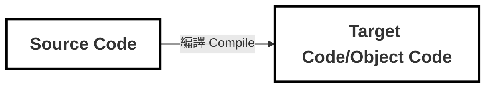

---
# try also 'default' to start simple
theme: 'seriph'
# random image from a curated Unsplash collection by Anthony
# like them? see https://unsplash.com/collections/94734566/slidev
background: https://cover.sli.dev
# some information about your slides (markdown enabled)
title: Vue.js 設計實戰
info: |
  ## Slidev Starter Template
  Presentation slides for developers.

  Learn more at [Sli.dev](https://sli.dev)
# apply UnoCSS classes to the current slide
class: text-center
# https://sli.dev/features/drawing
drawings:
  persist: false
# slide transition: https://sli.dev/guide/animations.html#slide-transitions
transition: slide-left
# enable MDC Syntax: https://sli.dev/features/mdc
mdc: true
# duration of the presentation
duration: 35min
# enable text selection and copy
selectable: true
---
<div class="flex justify-center items-center gap-4 text-green-300">
  <logos-vue class="text-4xl" />
  <h1 class="text-cyan-300">Vue.js 設計實戰</h1>
</div>
<h2>第 15 章 編譯器核心技術概覽</h2>
<p>Date: 2026/02/05</p>
<p>presenter: Hannah</p>

<div class="abs-br m-6 text-xl">
  <a href="https://github.com/HcySunYang/code-for-vue-3-book/tree/master/course6-%E7%BC%96%E8%AF%91%E5%99%A8" target="_blank" class="slidev-icon-btn">
    <carbon:logo-github />
  </a>
</div>

<!--
The last comment block of each slide will be treated as slide notes. It will be visible and editable in Presenter Mode along with the slide. [Read more in the docs](https://sli.dev/guide/syntax.html#notes)
-->

---
layout: two-cols
layoutClass: gap-16
---

# Table of contents

You can use the `Toc` component to generate a table of contents for your slides:

```html
<Toc minDepth="1" maxDepth="1" />
```

The title will be inferred from your slide content, or you can override it with `title` and `level` in your frontmatter.

::right::

<Toc text-sm minDepth="1" maxDepth="2" />


---
transition: fade-out
---


# Outline
探討 Vue.js 如何將模板 DSL 轉換為可在瀏覽器運行的 JS 渲染函數
- **15.1 模板 DSL 的編譯器** 
- **15.2 parser 的實作原理與狀態機** 
- **15.3 構造 AST** 
- **15.4 AST 的轉換與插件化架構**
  - **15.4.1 節點的訪問**
  - **15.4.2 轉換上下文與節點的操作**
  - **15.4.3 進入與退出**
- **15.5 將模板 AST 轉為 JavaScript AST**
- **15.6 程式碼生成**
<br>
<br>

<style>
li {
  font-size: 22px;
}
</style>

---
transition: slide-up
level: 2
---

<!-------- 3 -------->
# 15.1 模板 DSL 的編譯器
學習重點：
- 了解什麼是編譯器
- 了解編譯流程
- AST (Abstract Syntax Tree) 抽象語法樹的特性


---

## 編譯器 Compiler
廣義的 Compiler ，其實就是把一種語言（source code）轉換成另一種語言（object code）的橋樑



---

## 編譯過程

編譯後端不一定會包含「中間程式碼生成」和「最佳化」這兩個環節，這取決於特定的場景和實作。這兩個環節有時也叫做「中端」。


---
layout: two-cols-header
---
<!-- TODO: 補上 DSL 解釋 -->
## DSL (Domain-Specific Language) : 領域特定語言 

::left::


::right::
Vue.js 模板編譯器的目標程式碼其實就是渲染函數


<style>
.two-cols-header {
  column-gap: 20px; /* Adjust the gap size as needed */
}
</style>


---
transition: slide-up
level: 2
---
### Vue 模板編譯器的 workflow


1. Vue.js 模板編譯器會先對模板進行詞法分析和語法分析，獲得模板 AST
2. 透過「轉換器」，將模板 AST 轉成 JavaScript AST
3. 最後，根據 JavaScript AST 產生 JavaScript 程式碼，即渲染函數(目標程式碼)


<blockquote class="text-xl">
<b>AST (Abstract syntax tree) 抽象語法樹 是什麼？</b>

是一種「抽象化」的表示方式，把原始碼的語法結構以樹狀的形式呈現，隱藏了真實語法細節

樹上的每個節點都表示原始碼中的一種結構，模板 AST 其實就是用來描述模板的抽象語法樹
</blockquote>


---
layout: two-cols
layoutClass: gap-5
---

<div v-click="1">這段模板會被編譯成 AST →</div>

::left::

```html {*}{lines:true}
<div>
  <h1 v-if="ok">Vue Template</h1>
</div>
```

::right::

<div v-click="1">

<!-- TODO: Vue Template 內容不會出現在這嗎？ -->
```js {*}{lines:true}
const ast = {
  type: 'Root',
  children: [
    {
      type: 'Element',
      tag: 'div',  // <div> 節點
      children: [
        {
          type: 'Element',
          tag: 'h1',   // <h1> 標籤節點
          props: [
            // v-if 指令節點
            {
              type: 'Directive', // type 為 Directive 代表指令
              name: 'if',        // 指令名稱為 if，不帶有前綴 v-
              exp: { 
                type: 'Expression',
                content: 'ok'
              }
            }
          ]
        }
      ]
    }
  ]
}
```
</div>


<!--
AST 其實就是一個有層級結構的物件。模板 AST 具有與模板同構的嵌套結構。每一棵 AST 都有一個邏輯上的根節點，type 為 Root。模板中真正的根節點則是作為 Root 節點的 children 存 在 -->


---
transition: slide-up
level: 2
---


💡 AST 小結論
<v-clicks>

1. 不同類型的節點是透過節點的 type 屬性進行區分的。例如「標籤」節點的 type 值為 `Element`
2. 標籤節點的子節點儲存在其 children 陣列中
3. 標籤節點的「屬性」節點和「指令」節點會儲存在 props 陣列中
4. 不同類型的節點會使用不同的物件屬性來描述。例如「指令」節點擁有 `name` 屬性，用來表達指令的名稱，而「表達式」節點擁有 `content` 屬性，用來描述表達式的內容

</v-clicks>


---
transition: slide-up
level: 2
layout: two-cols
layoutClass: gap-5
---
::left::
透過 `parse` 函數來完成對模板的詞法分析和語法分析，並得到模板 AST


接著透過 `transform` 函數，將模板 AST 轉成 JavaScript AST


::right::

```js {*}{lines:true}
const template = `
  <div>
    <h1 v-if="ok">Vue Template</h1>
  </div>
`

const templateAST = parse(template)
const jsAST = transform(templateAST)
```

<!--
可以看到，parse 函數接收字串模板作為參數，將解析後得到的 AST 作為回傳值傳回
接著，要將模板 AST 轉換為 JavaScript AST。因為 Vue.js 模板編譯器的最終目標是產生渲染函數，而渲染函數本質上是 JavaScript 程式碼，所以我們 需要將模板 AST 轉換成用於描述渲染函數的 JavaScript AST
-->


---
transition: slide-up
level: 2
---

## 詞法分析 V.S 語法分析

|  | 詞法分析 (Lexical Analysis) | 語法分析 (Syntax Analysis) |
| --- | --- | --- |
| **別名** | 掃描 (Scanning) | 解析 (Parsing)
| **輸入** | 原始程式碼字串 (String)） | 詞法單元流 (Tokens) |
| **輸出** | Token 列表 (扁平的)（例如：`Identifier`、`Keyword`、`Punctuator`） | AST 語法樹 (有層級的) |
| **主要工作** | 切分字元、去除無意義資訊（空白/註解）、辨識基本詞彙單元 | 依語法規則把 token 組成結構、處理優先序/結合性 |
| **比喻** | 在字典裡查每一個單字的意思 | 分析句子的主詞、動詞、受詞結構 |
| **例子** | `v-if="ok"` → `Identifier(v)` `Punctuator(-)` `Identifier(if)` ... | `Element(h1)` 搭配 `Directive(if, exp=ok)` 組成 AST 節點 |


---
transition: slide-up
level: 2
---


```js {3} {lines:true}
const templateAST = parse(template)
const jsAST = transform(templateAST)
const code = generate(jsAST)
```

全貌：


---
transition: slide-up
level: 2
---

# 15.2 parser 的實作原理與狀態機
學習重點：
- 解析器 parser 的實作原理
- 有限狀態自動機(Finite State Machine / Finite State Automaton)


---
transition: slide-up
level: 2
---


我們現在有這三樣東西
* <span v-mark.circle.orange="1">parser</span>
* transformer
* generator

<div v-click="2" class="mt-2 border border-gray-400/60 rounded-md p-4">
  解析器

  * 傳入參數：「字串模板」
  * 解析流程：
    1. 逐一讀取字串模板中的字串
    2. 根據詞法規則將字串切割為一個個 Token，這裡的 Token，又叫「詞法記號」
</div>

<div v-click="3" class="mt-2 border border-gray-400/60 rounded-md p-2">
```html {*}{lines:true}
<p>Vue</p>
```
解析器會把這段字串模板切割為三個 Token：

`<p>` 、 `Vue`、`</p>`

<!--
Vue 是文字節點
-->
</div>


---
transition: slide-up
level: 2
---


### 解析器是如何對模板進行切割的？依據什麼規則？

<p v-click class="text-2xl">→ 有限狀態自動機</p>

<p v-click>
有限狀態自動機（Finite State Automaton，簡稱 **FSA** 或 **FSM**）是一個用來描述「系統行為」的模型
</p>

<p v-click>
簡單來說，它把一個系統看作是在不同「狀態」之間切換的過程
</p>

---
transition: slide-up
level: 2
---

## 有限狀態機的核心要素

<v-clicks>

1. **狀態 (States)**：系統目前的情況
   - 例如：開、關、待機、載入中
   - 因為狀態的數量是「有限」的，所以叫有限狀態機

2. **事件/輸入 (Events/Inputs)**：觸發改變的事情
   - 例如：按下按鈕、輸入密碼、刷卡

3. **轉移 (Transitions)**：規則
   - 當「狀態 A」遇到「事件 X」時，會變成「狀態 B」

4. **初始狀態 (Start State)**：系統一開始的樣子

</v-clicks>

---
transition: slide-up
level: 2
---

## 生活中的例子：捷運閘門 🚇

<v-clicks>

- **狀態 A：鎖定 (Locked)**
- **狀態 B：解鎖 (Unlocked)**

**運作邏輯（轉移）：**

1. 目前是「鎖定」 → 投入代幣/刷卡（事件） → 變成「解鎖」
2. 目前是「解鎖」 → 人推動閘門通過（事件） → 變成「鎖定」
3. 目前是「鎖定」 → 人硬推（事件） → 維持「鎖定」（可能發出警報）

</v-clicks>

<v-click>

這就是一個簡單的狀態機。清楚知道「現在是什麼狀態」，以及「發生什麼事會變成下一個狀態」

</v-click>

---
transition: slide-up
level: 2
---

## 為什麼程式設計需要它？

<v-click>

如果你不使用狀態機，你的程式碼可能會充滿大量的 `if-else` 或 `switch` 判斷，變成義大利麵程式碼（Spaghetti Code）。

</v-click>

<v-clicks>

**使用狀態機的好處：**

1. **邏輯清晰**：你把所有的可能性都畫成圖表，不會漏掉某種邊緣情況
2. **可預測性**：系統不會莫名其妙進入一個「未定義」的奇怪狀態
3. **易於除錯**：如果出錯，你只需檢查「當前狀態」和「輸入事件」是否正確

</v-clicks>


---
transition: slide-up
level: 2
---

## 常見的應用場景

<v-clicks>

1. **正規表達式 (Regex)**：其實就是一個狀態機，用來檢查字串是否符合規則

2. **編譯器 (Compiler) 與 解析器 (Parser)**

</v-clicks>

---
layout: two-cols
layoutClass: gap-5
transition: slide-up
level: 2
---

::left::

<v-click>

<span class="whitespace-nowrap">解析器會把這段字串模板切割為三個 Token：`<p>` 、 `Vue`、`</p>`</span>
```html {*}{lines:true}
<p>Vue</p>
```
</v-click>
<v-click>
解析器的狀態遷移圖：

</v-click>
::right::

<div class="flex flex-col justify-center h-full mt-4">

<!-- TODO: 確認這整個區塊 -->
<v-click>

1. **初始狀態**：解析器剛開始，還沒讀到任何內容

</v-click>

<v-click>

2. **標籤開始**：讀到 `<` 時進入此狀態，知道要開始讀標籤了

</v-click>

<v-click>

3. **標籤名稱**：讀取標籤的名稱
   - 讀完標籤名稱後遇到 `>`，有兩種情況：
     - → **狀態 1（初始）**：自閉合標籤（如 `<br/>`）或空標籤，回到初始狀態準備讀下一個
     - → **狀態 4（文本）**：有內容的標籤（如 `<p>Vue</p>`），進入文本狀態讀取標籤內容

</v-click>

<v-click>

4. **文本狀態**：讀取標籤之間的文字內容 (`Vue`)

</v-click>

<v-click>

5. **結束標籤**：讀到 `</` 符號，知道要結束標籤了

</v-click>

<v-click>

6. **結束標籤名稱**：讀取結束標籤的名稱（如 `p`）

</v-click>

<!-- 
- 「讀標籤名稱」
- 「讀屬性」
- 「讀內容」 -->
</div>


---
transition: slide-up
level: 2
---

TestTestTest


---
transition: slide-up
level: 2
---

# 15.3 構造 AST
<!-- TODO: 這邊要確認一下 -->
學習重點：
- 如何將 Token 列表轉換為樹狀結構的模板 AST
- 認識遞迴下降演算法 Recursive Descent

---
transition: slide-up
level: 2
---

# 15.4 AST 的轉換與插件化架構*
學習重點：
- 


---
layout: image-right
image: https://cover.sli.dev
---
<!-- 當作參考，先留下 -->
# Code

Use code snippets and get the highlighting directly, and even types hover!

```ts [filename-example.ts] {all|4|6|6-7|9|all} twoslash
// TwoSlash enables TypeScript hover information
// and errors in markdown code blocks
// More at https://shiki.style/packages/twoslash
import { computed, ref } from 'vue'

const count = ref(0)
const doubled = computed(() => count.value * 2)

doubled.value = 2
```

<arrow v-click="[4, 5]" x1="350" y1="310" x2="195" y2="342" color="#953" width="2" arrowSize="1" />

<!-- This allow you to embed external code blocks -->
<<< @/snippets/external.ts#snippet


<!--
Notes can also sync with clicks

[click] This will be highlighted after the first click

[click] Highlighted with `count = ref(0)`

[click:3] Last click (skip two clicks)
-->

---
level: 2
---
<!-- 當作參考，先留下 -->
# Shiki Magic Move

Powered by [shiki-magic-move](https://shiki-magic-move.netlify.app/), Slidev supports animations across multiple code snippets.

Add multiple code blocks and wrap them with <code>````md magic-move</code> (four backticks) to enable the magic move. For example:

````md magic-move {lines: true}
```ts {*|2|*}
// step 1
const author = reactive({
  name: 'John Doe',
  books: [
    'Vue 2 - Advanced Guide',
    'Vue 3 - Basic Guide',
    'Vue 4 - The Mystery'
  ]
})
```

```ts {*|1-2|3-4|3-4,8}
// step 2
export default {
  data() {
    return {
      author: {
        name: 'John Doe',
        books: [
          'Vue 2 - Advanced Guide',
          'Vue 3 - Basic Guide',
          'Vue 4 - The Mystery'
        ]
      }
    }
  }
}
```

```ts
// step 3
export default {
  data: () => ({
    author: {
      name: 'John Doe',
      books: [
        'Vue 2 - Advanced Guide',
        'Vue 3 - Basic Guide',
        'Vue 4 - The Mystery'
      ]
    }
  })
}
```

Non-code blocks are ignored.

```vue
<!-- step 4 -->
<script setup>
const author = {
  name: 'John Doe',
  books: [
    'Vue 2 - Advanced Guide',
    'Vue 3 - Basic Guide',
    'Vue 4 - The Mystery'
  ]
}
</script>
```
````

---

# Motions

Motion animations are powered by [@vueuse/motion](https://motion.vueuse.org/), triggered by `v-motion` directive.

```html
<div
  v-motion
  :initial="{ x: -80 }"
  :enter="{ x: 0 }"
  :click-3="{ x: 80 }"
  :leave="{ x: 1000 }"
>
  Slidev
</div>
```

<div class="w-60 relative">
  <div class="relative w-40 h-40">
    
    
    
  </div>

  <div
    class="text-5xl absolute top-14 left-40 text-[#2B90B6] -z-1"
    v-motion
    :initial="{ x: -80, opacity: 0}"
    :enter="{ x: 0, opacity: 1, transition: { delay: 2000, duration: 1000 } }">
    Slidev
  </div>
</div>

<!-- vue script setup scripts can be directly used in markdown, and will only affects current page -->
<script setup lang="ts">
const final = {
  x: 0,
  y: 0,
  rotate: 0,
  scale: 1,
  transition: {
    type: 'spring',
    damping: 10,
    stiffness: 20,
    mass: 2
  }
}
</script>

<div
  v-motion
  :initial="{ x:35, y: 30, opacity: 0}"
  :enter="{ y: 0, opacity: 1, transition: { delay: 3500 } }">

[Learn more](https://sli.dev/guide/animations.html#motion)

</div>


---
foo: bar
dragPos:
  square: 691,32,167,_,-16
---
<!-- 當作參考，先留下 -->
# Draggable Elements

Double-click on the draggable elements to edit their positions.

<br>

<!-- 當作參考，先留下 -->
###### Directive Usage

```md

```

<br>

###### Component Usage
```md
<v-drag text-3xl>
  <div class="i-carbon:arrow-up" />
  Use the `v-drag` component to have a draggable container!
</v-drag>
```

<v-drag pos="349,260,261,_,-15">
  <div text-center text-3xl border border-main rounded>
    Double-click me!
  </div>
</v-drag>


###### Draggable Arrow

```md
<v-drag-arrow two-way />
```

<v-drag-arrow pos="67,452,253,46" two-way op70 />

<!-- 當作參考，先留下 -->
---
src: ./pages/imported-slides.md
hide: false
---


---

<!-- 當作參考，先留下 -->
# Monaco Editor

Slidev provides built-in Monaco Editor support.

Add `{monaco}` to the code block to turn it into an editor:

```ts {monaco}
import { ref } from 'vue'
import { emptyArray } from './external'

const arr = ref(emptyArray(10))
```

Use `{monaco-run}` to create an editor that can execute the code directly in the slide:

```ts {monaco-run}
import { version } from 'vue'
import { emptyArray, sayHello } from './external'

sayHello()
console.log(`vue ${version}`)
console.log(emptyArray<number>(10).reduce(fib => [...fib, fib.at(-1)! + fib.at(-2)!], [1, 1]))
```
