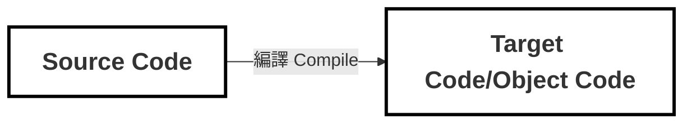
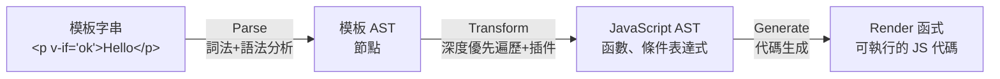

---
# try also 'default' to start simple
theme: 'seriph'
# random image from a curated Unsplash collection by Anthony
# like them? see https://unsplash.com/collections/94734566/slidev
background: https://cover.sli.dev
# some information about your slides (markdown enabled)
title: Vue.js 設計實戰
info: |
  ## Slidev Starter Template
  Presentation slides for developers.

  Learn more at [Sli.dev](https://sli.dev)
# apply UnoCSS classes to the current slide
class: text-center
# https://sli.dev/features/drawing
drawings:
  persist: false
# slide transition: https://sli.dev/guide/animations.html#slide-transitions
transition: slide-left
# enable MDC Syntax: https://sli.dev/features/mdc
mdc: true
# duration of the presentation
duration: 35min
# enable text selection and copy
selectable: true
---
<div class="flex justify-center items-center gap-4 text-green-300">
  <logos-vue class="text-4xl" />
  <h1 class="text-cyan-300">Vue.js 設計實戰</h1>
</div>
<h2>第 15 章 編譯器核心技術概覽</h2>
<p>Date: 2026/02/05</p>
<p>presenter: Hannah</p>

<div class="abs-br m-6 text-xl">
  <a href="https://github.com/HcySunYang/code-for-vue-3-book/tree/master/course6-%E7%BC%96%E8%AF%91%E5%99%A8" target="_blank" class="slidev-icon-btn">
    <carbon:logo-github />
  </a>
</div>

<!--
The last comment block of each slide will be treated as slide notes. It will be visible and editable in Presenter Mode along with the slide. [Read more in the docs](https://sli.dev/guide/syntax.html#notes)
-->


---
transition: fade-out
---


# Outline
探討 Vue.js 如何將模板 DSL 轉換為可在瀏覽器運行的 JS 渲染函數
- **15.1 模板 DSL 的編譯器**
- **15.2 parser 的實作原理與狀態機**
- **15.3 構造 AST**
- **15.4 AST 的轉換與插件化架構**
  - **15.4.1 節點的訪問**
  - **15.4.2 轉換上下文與節點的操作**
  - **15.4.3 進入與退出**
- **15.5 將模板 AST 轉為 JavaScript AST**
- **15.6 程式碼生成**
- **總結**
<br>
<br>

<style>
li {
  font-size: 22px;
}
</style>

---
transition: slide-up
level: 2
---

# 15.1 模板 DSL 的編譯器
學習重點：
- 了解什麼是編譯器
- 了解編譯流程
- AST (Abstract Syntax Tree) 抽象語法樹的特性


---

## 編譯器 Compiler
廣義的 Compiler ，其實就是把一種語言（source code）轉換成另一種語言（target code）的橋樑


```mermaid {theme: 'default'}
graph LR
  A["Source Code"]-->|編譯 Compile| B["Target Code/Object Code"]
  style A fill:#fff,stroke:#000,stroke-width:3px,font-size:22px,font-weight:bold
  style B fill:#fff,stroke:#000,stroke-width:3px,font-size:22px,font-weight:bold
```

<!--
語言 A 轉換成 語言 B 的過程
編譯前端：僅負責分析原始碼
編譯後端：通常負責生成目標程式碼
-->


---

## 編譯過程


編譯後端不一定會包含「中間程式碼生成」和「最佳化」這兩個環節，這取決於特定的場景和實作。這兩個環節有時也叫做「中端」。


---
layout: two-cols-header
---

## DSL (Domain-Specific Language) : 領域特定語言

::left::


::right::
DSL: 專門為特定領域、特定任務」而設計的語言，設計 DSL 通常會涉及到編譯技術。

Vue.js 模板和 JSX 就是 DSL。而 Vue.js 模板編譯器的目標程式碼就是「渲染函數」


<!--
  在 Vue 的 SFC 中，你寫的內容並不是單純的 HTML 或 JavaScript，而是經過設計的特定語法
  對 Vue.js 模板編譯器來說，原始碼是元件的模板，而目標程式碼是能夠在瀏覽器上執行的 JavaScript
-->

<style>
.two-cols-header {
  column-gap: 20px; /* Adjust the gap size as needed */
}
</style>


---
transition: slide-up
level: 2
---
### Vue.js 模板編譯器的工作流程


1. Vue.js 模板編譯器會先對模板進行詞法分析和語法分析，獲得模板 AST
2. 透過「轉換器」，將模板 AST 轉成 JavaScript AST
3. 最後，根據 JavaScript AST 產生 JavaScript 程式碼，即渲染函數(目標程式碼)


<blockquote class="text-xl">
<b>AST (Abstract syntax tree) 抽象語法樹 是什麼？</b>

把原始碼的語法結構以樹狀的形式呈現，隱藏了真實語法細節

樹上的每個節點都表示原始碼中的一種結構，**模板 AST 其實就是用來描述模板的抽象語法樹**
</blockquote>


---
layout: two-cols
layoutClass: gap-5
---

範例：

::left::

```html {*}{lines:true}
<div>
  <h1 v-if="ok">Vue Template</h1>
</div>
```
<div v-click="1">這段模板被編譯成 AST 後 →</div>

::right::

<div v-click="1">

```js {*}{lines:true}
const ast = {
  type: 'Root',
  children: [
    {
      type: 'Element',
      tag: 'div',  // <div> 節點
      children: [
        {
          type: 'Element',
          tag: 'h1',   // <h1> 標籤節點
          props: [
            // v-if 指令節點
            {
              type: 'Directive', // type 為 Directive 代表指令
              name: 'if',        // 指令名稱為 if，不帶有前綴 v-
              exp: {
                type: 'Expression', // 表達式節點
                content: 'ok'
              }
            }
          ]
        }
      ]
    }
  ]
}
```
</div>


<!--
AST 其實就是一個有層級結構的物件
Root: 代表整個模板內容的容器
-->


---
transition: slide-up
level: 2
---


💡 AST 小結論
<v-clicks>

1. 不同類型的節點是透過該節點的 type 屬性進行區分。例如「標籤」節點的 type 值為 `Element`
2. 標籤節點的子節點儲存在其 children 陣列中
3. 標籤節點的「屬性」節點和「指令」節點會儲存在 props 陣列中
4. 不同類型的節點會使用不同的物件屬性來描述。例如「指令」節點擁有 `name` 屬性，用來表達指令的名稱，而「表達式」節點擁有 `content` 屬性，用來描述表達式的內容

</v-clicks>


---
transition: slide-up
level: 2
layout: two-cols
layoutClass: gap-4
---


::left::
透過 `parse` 函式來完成對模板的「詞法分析」和「語法分析」，並得到模板 AST


接著透過 `transform` 函式，將模板 AST 轉成 JavaScript AST


::right::
<br />
<br />
<br />

```js {*}{lines:true}
const template = `
  <div>
    <h1 v-if="ok">Vue Template</h1>
  </div>
`

const templateAST = parse(template)
const jsAST = transform(templateAST)
```

<!--
可以看到，parse 函式接收字串模板作為參數，將解析後得到的 AST 並回傳
接著，要將模板 AST 轉換為 JavaScript AST。因為 Vue.js 模板編譯器的最終目標是產生渲染函數，而渲染函數本質上是 JavaScript 程式碼，所以我們 需要將模板 AST 轉換成用於描述渲染函數的 JavaScript AST
-->


---
transition: slide-up
level: 2
---

## 詞法分析 V.S 語法分析

|  | 詞法分析 (Lexical Analysis) | 語法分析 (Syntax Analysis) |
| --- | --- | --- |
| **別名** | 掃描 (Scanning) | 解析 (Parsing)
| **輸入** | String | Token Stream (一系列連續的 tokens) |
| **輸出** | Token 列表 (扁平的)（例如：`Identifier`、`Keyword`、`Punctuator`） | AST 語法樹 (有層級的) |
| **主要工作** | 切分字元、去除無意義資訊（空白/註解）、辨識基本詞彙 | 依語法規則把 token 組成結構、處理優先序/結合性 |
| **比喻** | 在字典裡查每一個單字的意思 | 分析句子的主詞、動詞、受詞結構 |
| **例子** | `v-if="ok"` → `Identifier(v)` `Punctuator(-)` `Identifier(if)` ... | `Element(h1)` 搭配 `Directive(if)` 組成 AST 節點 |

<!--
Parse 階段其實包含兩個子步驟：詞法分析和語法分析。這兩個步驟的分工很明確，我們用這張表來看一下。
首先是「別名」：詞法分析也叫掃描（Scanning），語法分析也叫解析（Parsing）。所以有時候看到「Parse」這個詞，要注意它有兩種意思：狹義的是指「語法分析」這個步驟，廣義的是指整個「解析階段」，包含詞法和語法兩個步驟。

接著看「輸入和輸出」：詞法分析的輸入是原始的字串，像是 `<div>Hello</div>` 這樣的模板字串，輸出是一個扁平的 Token 列表。然後語法分析接手，它的輸入就是這些 tokens，輸出則是有層級結構的 AST 語法樹。

「主要工作」方面：詞法分析負責把字串切分成有意義的小單位，像是標籤名稱、屬性、文本等等，並且會去除掉空白、註解這些無意義的資訊。語法分析則是根據語法規則，把這些 tokens 組合成有結構的樹狀資料，同時還要處理優先序和結合性的問題。

用一個比喻來理解：詞法分析就像在字典裡查每一個單字的意思，把句子拆解成一個個認識的詞彙；語法分析則是分析整個句子的文法結構，找出主詞、動詞、受詞之間的關係。

最後看「例子」：假設我們有 `v-if="ok"` 這個指令，詞法分析會把它切成 `v`（識別符）、`-`（標點符號）、`if`（識別符）、`=`、`"ok"` 這些小單位。而語法分析會理解這整體是一個 v-if 指令，並建立一個 Directive 節點。

所以簡單來說：詞法分析是「認字」，語法分析是「理解句子結構」。
-->


---
transition: slide-up
level: 2
---


```js {3} {lines:true}
const templateAST = parse(template)
const jsAST = transform(templateAST)
const code = generate(jsAST)
```

---
transition: slide-up
level: 2
---

全貌：


<v-clicks>
<div>
  <p>💡 小結論</p>
  1. parse: 詞法＋語法分析

  2. transform: AST 的轉換 (模板 → JS)

  3. generate: 將 JS AST 生成為 JS Code
</div>
</v-clicks>


<!--
  有了 JavaScript AST 後，就可以根據它產生渲染函數了，透過封裝 generate 函數來完成
  generate 函數會回傳字串，並儲存在 code 變數裡
-->


---
transition: slide-up
level: 2
---

# 15.2 parser 的實作原理與狀態機
學習重點：
- 解析器 parser 的實作原理
- 有限狀態自動機(Finite State Machine / Finite State Automaton)


---
transition: slide-up
level: 2
---

我們現在有這三樣東西
* <span v-mark.circle.orange="1">parser</span>
* transformer
* generator

<div v-click="2" class="mt-2 border border-gray-400/60 rounded-md p-4">
  解析器 parser

  * 傳入參數：字串
  * 解析流程：
    1. 逐一讀取模板中的字串
    2. 根據詞法規則將字串切割為一個個 Token，這裡的 Token，又叫「詞法記號」
</div>

<div v-click="3" class="mt-2 border border-gray-400/60 rounded-md p-2">
```html {*}{lines:true}
<p>Vue</p>
```
解析器會把這段字串模板切割為三個 Token：

`<p>` 、 `Vue`、`</p>`

</div>

<!--

好，現在我們要進入編譯器的核心部分了。Vue 的編譯器主要由三個部分組成：parser（解析器）、transformer（轉換器）、還有 generator（生成器）。

這節主要是講 parser 解析器

（點擊）解析器的工作其實很直觀，它接收的是一個字串，也就是我們寫的模板。然後它會做兩件事：

第一，逐一讀取模板中的字元
第二，根據詞法規則，把這些字串切割成一個個的 Token。這裡的 Token 有個比較正式的名字，叫做「詞法記號」

（點擊）我們來看一個最簡單的例子：假設模板是 `<p>Vue</p>`，這就是一段普通的字串。

解析器會把它切割成三個 Token：
- 第一個是開始標籤 `<p>`
- 第二個是文本內容 `Vue`（這是一個文字節點）
- 第三個是結束標籤 `</p>`

所以解析器做的事情就是：把一整段連續的字串，切成一個個有意義的小單位，方便後續處理。
-->


---
transition: slide-up
level: 2
---


### 解析器是如何對模板進行切割的？依據什麼規則？

<p v-click class="text-2xl">→ 有限狀態自動機</p>

<p v-click>
有限狀態自動機（Finite State Automaton，簡稱 FSA 或 FSM）是一個用來描述「系統行為」的模型
</p>

<p v-click>
簡單來說，它把一個系統看作是在不同「狀態」之間自動切換的過程
</p>

---
transition: slide-up
level: 2
---

## 有限狀態機的核心要素

<v-clicks>

1. **狀態 (States)**：系統目前的情況
   - 例如：開、關、待機、載入中
   - 因為狀態的數量是「有限」的，所以叫有限狀態機

2. **事件/輸入 (Events/Inputs)**：觸發改變的事情
   - 例如：按下按鈕、輸入密碼、刷卡

3. **轉移 (Transitions)**：規則
   - 當「狀態 A」遇到「事件 X」時，會變成「狀態 B」

4. **初始狀態 (Start State)**：系統一開始的樣子

</v-clicks>

---
transition: slide-up
level: 2
---

## 生活中的例子：捷運閘門 🚇

<v-clicks>

- **狀態 A：鎖定 (Locked)**
- **狀態 B：解鎖 (Unlocked)**

**運作邏輯（轉移）：**

1. 目前是「鎖定」 → 投入代幣/刷卡（事件） → 變成「解鎖」
2. 目前是「解鎖」 → 人推動閘門通過（事件） → 變成「鎖定」
3. 目前是「鎖定」 → 人硬推（事件） → 維持「鎖定」（可能發出警報）

</v-clicks>

<v-click>

這就是一個簡單的狀態機。清楚知道「現在是什麼狀態」，以及「發生什麼事會變成下一個狀態」

</v-click>

---
transition: slide-up
level: 2
---

## 為什麼需要狀態機？

<v-click>

如果你不使用狀態機，你的程式碼可能會充滿大量的 `if-else` 或 `switch` 判斷，變成義大利麵程式碼（Spaghetti Code）

</v-click>

<v-clicks>

**使用狀態機的好處：**

1. **邏輯清晰**：你把所有的可能性都畫成圖表，不會漏掉某種邊緣情況
2. **可預測性**：系統不會莫名其妙進入一個「未定義」的奇怪狀態
3. **易於除錯**：如果出錯，你只需檢查「當前狀態」和「輸入事件」是否正確

</v-clicks>


---
transition: slide-up
level: 2
---

## 常見的應用場景

<v-clicks>

1. **正規表達式 (Regex)**：其實就是一個狀態機，用來檢查字串是否符合規則
2. **編譯器 (Compiler) 與 解析器 (Parser)**

</v-clicks>

---
layout: two-cols
layoutClass: gap-5
transition: slide-up
level: 2
---

::left::

<span class="whitespace-nowrap">解析器會把這段字串模板切割為三個 Token：`<p>` 、 `Vue`、`</p>`</span>
```html {*}{lines:true}
<p>Vue</p>
```

<div class="relative mt-2" style="height: 420px;">
  <!-- 狀態節點 -->
  <!-- 狀態 1: 初始 -->
  <div :class="['absolute', 'w-20', 'h-20', 'rounded-full', 'border-3', 'flex', 'items-center', 'justify-center', 'text-xs', 'font-bold', 'transition-all', 'duration-500', $clicks >= 1 && $clicks <= 1 ? 'bg-blue-500 border-blue-600 text-white scale-110 shadow-lg' : 'bg-gray-100 border-gray-300 text-gray-600']" style="left: 200px; top: 10px;">
    <div class="text-center">1.初始<br/>狀態</div>
  </div>

  <!-- 狀態 2: 標籤開始 -->
  <div :class="['absolute', 'w-20', 'h-20', 'rounded-full', 'border-3', 'flex', 'items-center', 'justify-center', 'text-xs', 'font-bold', 'transition-all', 'duration-500', $clicks >= 2 && $clicks <= 2 ? 'bg-green-500 border-green-600 text-white scale-110 shadow-lg' : 'bg-gray-100 border-gray-300 text-gray-600']" style="left: 50px; top: 120px;">
    <div class="text-center">2. 標籤<br/>開始</div>
  </div>

  <!-- 狀態 3: 標籤名稱 -->
  <div :class="['absolute', 'w-20', 'h-20', 'rounded-full', 'border-3', 'flex', 'items-center', 'justify-center', 'text-xs', 'font-bold', 'transition-all', 'duration-500', $clicks >= 3 && $clicks <= 3 ? 'bg-purple-500 border-purple-600 text-white scale-110 shadow-lg' : 'bg-gray-100 border-gray-300 text-gray-600']" style="left: 50px; top: 250px;">
    <div class="text-center">3. 標籤<br/>名稱</div>
  </div>

  <!-- 狀態 4: 文本 -->
  <div :class="['absolute', 'w-20', 'h-20', 'rounded-full', 'border-3', 'flex', 'items-center', 'justify-center', 'text-xs', 'font-bold', 'transition-all', 'duration-500', $clicks >= 4 && $clicks <= 4 ? 'bg-orange-500 border-orange-600 text-white scale-110 shadow-lg' : 'bg-gray-100 border-gray-300 text-gray-600']" style="left: 350px; top: 120px;">
    <div class="text-center">4. 文本<br/>狀態</div>
  </div>

  <!-- 狀態 5: 結束標籤 -->
  <div :class="['absolute', 'w-20', 'h-20', 'rounded-full', 'border-3', 'flex', 'items-center', 'justify-center', 'text-xs', 'font-bold', 'transition-all', 'duration-500', $clicks >= 5 && $clicks <= 5 ? 'bg-red-500 border-red-600 text-white scale-110 shadow-lg' : 'bg-gray-100 border-gray-300 text-gray-600']" style="left: 350px; top: 250px;">
    <div class="text-center">5. 結束<br/>標籤</div>
  </div>

  <!-- 狀態 6: 結束標籤名稱 -->
  <div :class="['absolute', 'w-20', 'h-20', 'rounded-full', 'border-3', 'flex', 'items-center', 'justify-center', 'text-xs', 'font-bold', 'transition-all', 'duration-500', $clicks >= 6 && $clicks <= 6 ? 'bg-pink-500 border-pink-600 text-white scale-110 shadow-lg' : 'bg-gray-100 border-gray-300 text-gray-600']" style="left: 200px; top: 330px;">
    <div class="text-center">6. 結束標籤<br/>名稱</div>
  </div>

  <!-- 箭頭和標註 -->
  <!-- 1 -> 2: 遇到 < -->
  <div v-if="$clicks >= 2" class="absolute text-xs text-blue-500 font-bold" style="left: 180px; top: 70px;">
    讀 <code>&lt;</code>
  </div>

  <!-- 2 -> 3: 遇到字母 -->
  <div v-if="$clicks >= 3" class="absolute text-xs text-green-500 font-bold" style="left: 40px; top: 190px;">
    讀 <code>p</code>
  </div>

  <!-- 3 -> 1: 遇到 > -->
  <div v-if="$clicks >= 3" class="absolute text-xs text-purple-500 font-bold" style="left: 140px; top: 270px;">
    讀 <code>&gt;</code> 回初始
  </div>

  <!-- 1 -> 4: 遇到文本 -->
  <div v-if="$clicks >= 4" class="absolute text-xs text-orange-500 font-bold" style="left: 280px; top: 150px;">
    讀 <code>V(Vue)</code>
  </div>

  <!-- 4 -> 5: 遇到 < -->
  <div v-if="$clicks >= 5" class="absolute text-xs text-red-500 font-bold" style="left: 305px; top: 290px;">
    讀 <code>&lt;/</code>
  </div>

  <!-- 5 -> 6: 遇到字母 -->
  <div v-if="$clicks >= 6" class="absolute text-xs text-pink-500 font-bold" style="left: 230px; top: 305px;">
    讀 <code>p</code>
  </div>

  <!-- 6 -> 1: 遇到 > -->

  <!-- 當前處理字元提示 -->
  <div v-if="$clicks >= 1" class="absolute left-0 top-0 border border-blue-300 rounded px-3 py-2 text-sm">
    <span v-if="$clicks === 1">🔵 開始解析</span>
    <span v-else-if="$clicks === 2">🟢 讀到 <code>&lt;</code></span>
    <span v-else-if="$clicks === 3">🟣 讀到 <code>p</code> 和 <code>&gt;</code></span>
    <span v-else-if="$clicks === 4">🟠 讀到文本 <code>Vue</code></span>
    <span v-else-if="$clicks === 5">🔴 讀到 <code>&lt;/</code></span>
    <span v-else-if="$clicks === 6"><span class="inline-block w-3 h-3 rounded-full bg-pink-500 mr-1 align-middle"></span> 讀到 <code>p</code> 和 <code>&gt;</code></span>
  </div>
</div>

::right::

<div class="flex flex-col justify-center h-full mt-4">
<div>解析器的狀態遷移：</div>

<v-click>

1. **初始狀態**：解析器剛開始，還沒讀到任何內容

</v-click>

<v-click>

2. **標籤開始**：讀到 `<` 時進入此狀態，知道要開始讀標籤了

</v-click>

<v-click>

3. **標籤名稱**：讀取標籤的名稱（如 `p`）
   - 讀完標籤名稱後遇到 `>`，產生標籤 token 並**回到初始狀態（狀態 1）**
   - 回到初始狀態後，根據下一個字元決定：
     - 遇到文本 → 進入**狀態 4**
     - 遇到 `<` → 進入**狀態 2**

</v-click>

<v-click>

4. **文本狀態**：讀取標籤之間的文字內容 (`Vue`)

</v-click>

<v-click>

5. **結束標籤**：讀到 `</` 符號，知道要結束標籤了

</v-click>

<v-click>

6. **結束標籤名稱**：讀取結束標籤的名稱（如 `p`）

</v-click>

</div>

<!--
- 「讀標籤名稱」
- 「讀屬性」
- 「讀內容」 -->


---
transition: slide-up
level: 2
---

解析 HTML 和產生 Tokens 的過程是有規範可遵循的。在 WHATWG 發布的關於瀏覽器解析 HTML 的規格中，說明了[狀態遷移](https://html.spec.whatwg.org/#data-state)


<!-- 在「初始狀態」(Data State)下，當遇到字元 < 時，狀 狀態機會遷移到 tag open state，即「標籤開始狀態」。如果遇到字符 < 以外的字符，規範中也都有對應的說明，應該讓狀態機遷移到怎樣的狀態 -->


---
transition: slide-up
level: 2
---

有限狀態自動機可以幫助我們完成對模板的「標記化(tokenized)」

[codepen](https://codepen.io/hangineer/pen/emzrgyv)
tokenize
<div class="max-h-[270px] overflow-y-auto">

```js {*}{lines:true}
const State = {
    initial: 1,
    tagOpen: 2,
    tagName: 3,
    text: 4,
    tagEnd: 5,
    tagEndName: 6
}

function isAlpha(char) {
    return char >= 'a' && char <= 'z' || char >= 'A' && char <= 'Z'
}
// tokenize 函式實作了有限狀態自動機
function tokenize(str) {
  let currentState = State.initial
  const chars = []
  const tokens = []

  while(str) {
    const char = str[0]

    switch (currentState) {
      case State.initial:
        if (char === '<') {
          currentState = State.tagOpen
          str = str.slice(1)
        } else if (isAlpha(char)) {
          currentState = State.text
          chars.push(char)
          str = str.slice(1)
        }
        break

      case State.tagOpen:
        if (isAlpha(char)) {
          currentState = State.tagName
          chars.push(char)
          str = str.slice(1)
        } else if (char === '/') {
          currentState = State.tagEnd
          str = str.slice(1)
        }
        break

      case State.tagName:
        if (isAlpha(char)) {
          chars.push(char)
          str = str.slice(1)
        } else if (char === '>') {
          currentState = State.initial
          tokens.push({
            type: 'tag',
            name: chars.join('')
          })
          chars.length = 0
          str = str.slice(1)
        }
        break

      case State.text:
        if (isAlpha(char)) {
          chars.push(char)
          str = str.slice(1)
        } else if (char === '<') {
          currentState = State.tagOpen
          tokens.push({
            type: 'text',
            content: chars.join('')
          })
          chars.length = 0
          str = str.slice(1)
        }
        break

      case State.tagEnd:
        if (isAlpha(char)) {
          currentState = State.tagEndName
          chars.push(char)
          str = str.slice(1)
        }
        break

      case State.tagEndName:
        if (isAlpha(char)) {
          chars.push(char)
          str = str.slice(1)
        } else if (char === '>') {
          currentState = State.initial
          tokens.push({
            type: 'tagEnd',
            name: chars.join('')
          })
          chars.length = 0
          str = str.slice(1)
        }
        break
    }
  }

  return tokens
}
```

</div>

<div v-click class="mt-3">

```js {*}{lines:true}
const tokens = tokenize(`<p>Vue</p>`)
// [
//   { type: 'tag', name: 'p' },   // 開始標籤
//   { type: 'text', content: 'Vue' }, // 文本節點
//   { type: 'tagEnd', name: 'p' } // 結束標籤
// ]
```

</div>

<!--

首先，我們定義了狀態機的六個狀態：
1. initial（初始狀態）
2. tagOpen（標籤開始狀態）
3. tagName（標籤名稱狀態）
4. text（文本狀態）
5. tagEnd（結束標籤狀態）
6. tagEndName（結束標籤名稱狀態）

還有一個輔助函式 isAlpha，用來判斷當前字元是不是字母。

接著是核心的 tokenize 函式。它接收一個模板字串，並返回切割好的 Token 陣列。

函式內部有三個變數：
- currentState：記錄狀態機當前的狀態，一開始是初始狀態
- chars：用來暫存讀到的字元
- tokens：最終要返回的 Token 陣列

然後用一個 while 迴圈來驅動狀態機，只要字串還沒讀完，狀態機就會持續運行。

迴圈內部用 switch 來處理不同狀態下的邏輯。我們來看幾個重要的狀態轉換：

**初始狀態（State.initial）：**
- 如果遇到 `<`，就切換到「標籤開始狀態」
- 如果遇到字母，就切換到「文本狀態」，同時把字元存進 chars

**標籤開始狀態（State.tagOpen）：**
- 如果遇到字母，就切換到「標籤名稱狀態」，開始收集標籤名稱
- 如果遇到 `/`，表示這是結束標籤，切換到「結束標籤狀態」

**標籤名稱狀態（State.tagName）：**
- 如果遇到字母，保持在這個狀態，繼續收集字元
- 如果遇到 `>`，表示標籤名稱讀完了，這時要做三件事：
  1. 切換回初始狀態
  2. 創建一個 tag 類型的 Token，name 就是剛才收集的字元
  3. 清空 chars 陣列，準備收集下一段內容

**文本狀態（State.text）：**
- 如果遇到字母，保持狀態，繼續收集文本
- 如果遇到 `<`，表示文本結束了，要切換到標籤開始狀態，同時創建一個 text 類型的 Token

**結束標籤狀態（State.tagEnd）：**
- 遇到字母時，切換到「結束標籤名稱狀態」

**結束標籤名稱狀態（State.tagEndName）：**
- 如果遇到字母，繼續收集
- 如果遇到 `>`，切換回初始狀態，並創建一個 tagEnd 類型的 Token

整個過程就是這樣，透過狀態的不斷切換，我們把一整串模板字串切成了一個個有意義的 Token

這段 code 也還有可以優化的空間，像是可以透過正規表示式來精簡 tokenize 函式
-->


---
transition: slide-up
level: 2
---


# 15.3 構造 AST

學習重點：
- 如何將 Token 列表轉換為樹狀結構的模板 AST


<br />

不同用途的編譯器之間可能會有非常大的差異，像是 AST 的建構方式，唯一的共同點：「原始碼」→「目標程式碼」
- JavaScript：常用遞迴下降演算法，需處理運算子優先級等問題
- Vue.js 模板 DSL：DSL 不要求圖靈完備，只需滿足特定場景
- 通用用途語言(GPL)可實作領域特定語言(DSL)

P.S 圖靈完備：簡單來說，能用來寫各種程式邏輯的語言就是圖靈完備

<!--
【講稿】

在進入 Vue 模板的 AST 建構之前，我們需要先理解一件重要的事：不同用途的編譯器之間可能會有非常大的差異。

雖然所有編譯器的唯一共同點都是「把原始碼轉換成目標程式碼」，但具體的實作方式，尤其是 AST 的建構方式，可能會完全不同。

**JavaScript 的 AST 建構**比較複雜。因為 JavaScript 是一門通用程式語言，它需要處理很多複雜的語法規則，像是運算子的優先級。通常會用遞迴下降演算法來處理這些問題。

**Vue.js 模板的 AST 建構**就簡單多了。因為 Vue 模板是一個 DSL，也就是領域特定語言。DSL 的特點是：它不需要圖靈完備，只需要滿足特定場景的需求就好。實際上，任何通用用途語言(GPL)都可以用來實作領域特定語言(DSL)。

補充說明一下，這裡提到的「圖靈完備」，簡單來說就是：如果一個語言可以用來寫各種程式邏輯，實現任何可計算的功能，那它就是圖靈完備的。Vue 模板不需要這麼強大，它只需要描述 UI 結構就好。
-->

---
transition: slide-up
level: 2
---

HTML 是一種標記語言，格式非常固定。 因此，HTML 的 AST 將擁有與 HTML 標籤非常類似的崁套結構

```html {*}{lines:true}
<div>
  <p>Vue</p>
  <p>Template</p>
</div>
```
<div class="max-h-[340px] overflow-y-auto">

```js {*}{lines:true}
const ast = {
  type: 'Root', // 根節點
  children: [
    {
      type: 'Element',
      tag: 'div',
      children: [
        {
          type: 'Element',
          tag: 'p', // 第一個子節點
          children: [
            {
              type: 'Text',
              content: 'Vue'
            }
          ]
        },
        {
          type: 'Element',
          tag: 'p', // 第二個子節點
          children: [
            {
              type: 'Text',
              content: 'Template'
            }
          ]
        }
      ]
    }
  ]
}
```
</div>

<!--
  Vue 模板建 AST 較簡單：HTML 的標籤格式固定，標籤之間自然形成父子關係，所對應的 AST 與 HTML 結構相似，不需要處理太多複雜的語法規則
-->


---
transition: slide-up
level: 2
---

了解了 AST 的結構後，接下來是使用 Token 構造出一棵 AST

拿上一節的 tokenize 函式來用

```js {*}{lines:true}
const tokens = tokenize(`<div><p>Vue</p><p>Template</p></div>`)
```

會得到如下的結果
```js {*}{lines:true}
const tokens = [
  { type: "tag", name: "div" },
  { type: "tag", name: "p" },
  { type: "text", content: "Vue" },
  { type: "tagEnd", name: "p" },
  { type: "tag", name: "p" },
  { type: "text", content: "Template" },
  { type: "tagEnd", name: "p" },
  { type: "tagEnd", name: "div" }
]
```


我們需要處理每個 tokens，在這個過程中，需要建立一個堆疊 `elementStack`，用於維護元素間的父子關係。每遇到一個「開始標籤」節點，就會建立一個 Element 的 AST 節點，並將其寫入堆疊中。遇到一個「結束標籤」節點，就會彈出目前棧頂的節點

---
transition: slide-up
level: 2
---

# elementStack 與 AST 建構過程

```html {*}{lines:true}
<div>
  <p>Vue</p>
  <p>Template</p>
</div>
```

<div class="grid grid-cols-3 gap-6 text-xs mt-4">

<div>
<div class="text-center font-bold mb-3 text-base">↓ 掃描 Token</div>
<div class="space-y-1.5 font-mono text-xs">
  <div v-click class="px-2 py-1 border-2 border-dashed border-gray-400 rounded text-center bg-amber-500/10">開始標籤(div)</div>
  <div v-click class="px-2 py-1 border-2 border-dashed border-gray-400 rounded text-center bg-amber-500/10">開始標籤(p)</div>
  <div v-click class="px-2 py-1 border-2 border-dashed border-gray-400 rounded text-center bg-amber-500/10">文本(Vue)</div>
  <div v-click class="px-2 py-1 border-2 border-dashed border-gray-400 rounded text-center bg-amber-500/10">結束標籤(p)</div>
  <div v-click class="px-2 py-1 border-2 border-dashed border-gray-400 rounded text-center bg-amber-500/10">開始標籤(p)</div>
  <div v-click class="px-2 py-1 border-2 border-dashed border-gray-400 rounded text-center bg-amber-500/10">文本(Template)</div>
  <div v-click class="px-2 py-1 border-2 border-dashed border-gray-400 rounded text-center bg-amber-500/10">結束標籤(p)</div>
  <div v-click class="px-2 py-1 border-2 border-dashed border-gray-400 rounded text-center bg-amber-500/10">結束標籤(div)</div>
</div>
</div>

<div>
<div class="text-center font-bold mb-3 text-base">elementStack</div>
<div class="flex flex-col items-center">
<div class="w-36 h-64 border-2 border-dashed border-cyan-500/50 flex flex-col-reverse items-center pb-3 px-3">
  <div class="w-full text-center py-1.5 bg-gray-700 rounded-full text-white text-xs mt-1.5">Root</div>
  <div v-if="$clicks >= 1 && $clicks <= 7" class="w-full text-center py-1.5 bg-cyan-600 rounded-full text-white text-xs mt-1.5">div</div>
  <div v-if="$clicks >= 2 && $clicks <= 3" class="w-full text-center py-1.5 bg-cyan-500 rounded-full text-white text-xs mt-1.5">p</div>
  <div v-if="$clicks >= 5 && $clicks <= 6" class="w-full text-center py-1.5 bg-cyan-500 rounded-full text-white text-xs mt-1.5">p</div>
</div>
</div>
</div>

<div>
<div class="text-center font-bold mb-3 text-base">AST</div>
<div class="flex justify-center">
<div class="font-mono" style="font-size: 10px;">
  <div class="flex flex-col items-center">
    <div class="px-2 py-1 bg-gray-700 rounded-full text-white">Root</div>
    <div v-click="1" class="w-0.5 h-3 bg-gray-400"></div>
    <div v-click="1" class="px-2 py-1 bg-gray-600 rounded-full text-white">Element(div)</div>
    <div v-click="2" class="w-0.5 h-2 bg-gray-400"></div>
    <div v-click="2" class="flex gap-4">
      <div class="flex flex-col items-center">
        <div class="px-2 py-1 bg-gray-600 rounded-full text-white">Element(p)</div>
        <div v-click="3" class="w-0.5 h-2 bg-gray-400"></div>
        <div v-click="3" class="px-2 py-1 bg-gray-500 rounded-full text-white">Text(Vue)</div>
      </div>
      <div v-click="5" class="flex flex-col items-center">
        <div class="px-2 py-1 bg-gray-600 rounded-full text-white">Element(p)</div>
        <div v-click="6" class="w-0.5 h-2 bg-gray-400"></div>
        <div v-click="6" class="px-2 py-1 bg-gray-500 rounded-full text-white">Text(Template)</div>
      </div>
    </div>
  </div>
</div>
</div>
</div>

</div>

<div v-click class="mt-4 text-center text-xs opacity-70 text-red">
💡 開始標籤 → push 進堆疊、結束標籤 → pop 出堆疊、文本 → 不會操作堆疊
</div>


<!--
棧頂的節點 = 父節點

掃描過程中遇到的所有節點，都會作為目前棧頂節點的子節點，並加入到棧頂節點的 children 屬性下。
-->

---
transition: slide-up
level: 2
---
掃描 Token Stream 並建構 AST 的具體實作如下:

[codepen](https://codepen.io/hangineer/pen/YPWLZaP)

<div class="max-h-[400px] overflow-y-auto">

```js {*}{lines:true}
function parse(str) {
  const tokens = tokenize(str)

  const root = {
    type: 'Root',
    children: []
  }

  const elementStack = [root]

  while (tokens.length) {
    const parent = elementStack[elementStack.length - 1]
    const t = tokens[0]

    switch (t.type) {
      case 'tag':
        const elementNode = {
          type: 'Element',
          tag: t.name,
          children: []
        }
        parent.children.push(elementNode)
        elementStack.push(elementNode)
        break

      case 'text':
        const textNode = {
          type: 'Text',
          content: t.content
        }
        parent.children.push(textNode)
        break

      case 'tagEnd':
        elementStack.pop()
        break
    }

    tokens.shift()
  }

  return root
}
```

</div>

<!--

parse 函式負責把 tokens 轉換成 AST。

首先，parse 函式接收字串作為參數。

1, 第一步，我們先呼叫剛才講過的 tokenize 函式，把模板進行標記化，得到一個 tokens 陣列。

2. 接著，我們創建一個 Root 根節點，它就是整個 AST 的容器，有一個空的 children 陣列。

3. 然後，我們創建一個 elementStack 堆疊。用來維護元素之間的父子關係。起初，堆疊裡只有 Root 根節點。

3. 進入核心邏輯： while 迴圈來掃描 tokens，直到所有 Token 都被處理完畢為止

在迴圈中，我們首先獲取當前堆疊頂端的節點作為父節點 parent。然後取出當前要處理的 Token。

接下來用 switch 來判斷 Token 的類型，有三種情況：

**第一種：遇到開始標籤（tag）**
這時候要創建一個 Element 類型的 AST 節點，tag 屬性就是標籤名稱，children 先設為空陣列。然後做兩件事：
1. 把這個節點加到父節點的 children 裡
2. 把這個節點壓入堆疊，因為它可能會有子節點

**第二種：遇到文本（text）**
content 就是文本內容。然後把它加到父節點的 children 裡。注意，文本節點不用壓入堆疊，因為文本不會有子節點

**第三種：遇到結束標籤（tagEnd）**
這表示當前元素已經處理完畢，它的所有子節點都已經處理好了。這時候要把堆疊頂端的節點彈出，讓堆疊回到上一層的父節點。

每處理完一個 Token，我們就用 shift 把它從 tokens 陣列移除

最後，當所有 Token 都處理完畢，我們就返回 Root 節點，這就是完整的 AST 了。

補充說明：目前的實作仍然存在諸多問題，例如無法處理自閉合標籤等。這些問題會在第 16 章詳細講解。
-->


---
transition: slide-up
level: 2
---

# 15.4 AST 的轉換與插件化架構
學習重點：
- 關於 AST 的轉換
- 如何對 AST 進行新增、刪除、修改、查詢

---
transition: slide-up
level: 2
---


## 15.4.1 節點的訪問


為了對 AST 進行轉換，我們需要存取 AST 的每一個節點，這樣才有機會對特定節點進行修改等操作


---
transition: slide-up
level: 2
---

<!-- 由於 AST 是樹狀資料結構，所以我們需要寫一個「深度優先」的遍歷演算法，實現對 AST 中節點的存取。 -->
### 第一步：寫一個 `dump` 函式
用來找出目前 AST 中節點的資訊，如下面的程式碼所示：

<div class="max-h-[400px] overflow-y-auto">

```js {*}{lines:true}
function dump(node, indent = 0) {
  // 節點的類型
  const type = node.type


  const desc = node.type === 'Root'
    ? ''
    : node.type === 'Element'
      ? node.tag
      : node.content

  console.log(`${'-'.repeat(indent)}${type}: ${desc}`)

  // 印出子節點
  if (node.children) {
    node.children.forEach(n => dump(n, indent + 2))
  }
}

// 執行
const ast = parse(`<div><p>Vue</p><p>Template</p></div>`)
dump(ast)


/*
  執行結果
  Root:
    --Element: div
    ----Element: p
    ------Text: Vue
    ----Element: p
    ------Text: Template
*/
```
</div>

<!--
  節點的描述，如果是根節點，則沒有描述
  如果是 Element 類型的節點，則使用 node.tag 作為節點的描述
  如果是 Text 類型的節點，則使用 node.content 作為節點的描述
-->


---
transition: slide-up
level: 2
---

### 第二步：實現對 AST 中節點的存取
存取節點的方式：從 AST 根節點開始，進行深度優先遍歷

````md magic-move {lines: true}
```js
function traverseNode(ast) {
  const currentNode = ast
  const children = currentNode.children

  if (children) {
    for (let i = 0; i < children.length; i++) {
      traverseNode(children[i])
    }
  }
}
```

```js
function traverseNode(ast) {
  const currentNode = ast

  if (currentNode.type === 'Element' && currentNode.tag === 'p') {
    currentNode.tag = 'h1'
  }

  const children = currentNode.children
  if (children) {
    for (let i = 0; i < children.length; i++) {
      traverseNode(children[i])
    }
  }
}
```
````
<p v-click>有了 traverseNode 函式之後，就可以實現各種對 AST 節點的操作和轉換了</p>

<!--

進入轉換階段的第二步：實現對 AST 中節點的存取。

訪問節點的方式很簡單，就是從 AST 根節點開始，進行深度優先遍歷。我們來看這個 traverseNode 函式。

**第一版：基本遍歷**


traverseNode 函式接收 ast 作為參數，ast 本身就是 Root 節點。我們把它賦值給 currentNode。

然後取出當前節點的 children。如果有子節點，就用一個 for 迴圈，對每個子節點遞迴呼叫 traverseNode。

這樣就能遍歷整個 AST 樹的所有節點。這是最基本的深度優先遍歷。

**（點擊後）第二版：加入節點操作**

有了基本的遍歷能力之後，我們就可以在遍歷過程中對節點進行操作。

你看，在取得 currentNode 之後，在遍歷子節點之前，我們加了一段邏輯：

檢查當前節點的類型是不是 Element，並且標籤名稱是不是 p。如果條件符合，就把標籤名稱改成 h1。

這就是一個簡單的轉換功能：將 AST 中所有的 p 標籤轉換為 h1 標籤。

然後再像之前一樣，遍歷所有子節點。

所以 traverseNode 函式的核心邏輯就是：先處理當前節點，再遞迴處理子節點。這就是深度優先遍歷的典型模式。


-->


---
transition: slide-up
level: 2
---

<div class="max-h-[400px] overflow-y-auto">

### 第三步：封裝 transform 函式，用來對 AST 進行轉換

```js {*}{lines:true}
function transform(ast) {
  traverseNode(ast)
  dump(ast)
}

const ast = parse(`<div><p>Vue</p><p>Template</p></div>`)
transform(ast)

/*
  執行結果
  Root:
    --Element: div
    ----Element: h1
    ------Text: Vue
    ----Element: h1
    ------Text: Template
*/
```
</div>

---
transition: slide-up
level: 2
---

潛在問題：隨著功能的不斷增加（進行更多的操作），traverseNode 可能會變得越來越「臃腫」

<div v-click>能否對節點的操作和存取進行解耦呢？</div>

<div v-click class="text-orange-500 text-xl mt-2">使用回調函式來實現解耦</div>

<div v-click>

```js {*}{lines:true}
function traverseNode(ast, context) {
  const currentNode = ast

  const transforms = context.nodeTransforms
  for (let i = 0; i < transforms.length; i++) {
    transforms[i](currentNode, context)
  }

  const children = currentNode.children
  if (children) {
    for (let i = 0; i < children.length; i++) {
      traverseNode(children[i], context)
    }
  }
}
```
</div>

<p v-click>這種設計模式在編譯器中很常見，可以靈活擴展和組合不同的轉換功能，而不需要修改核心的遍歷邏輯</p>
<!--

來看優化後的 traverseNode 函式。這個版本使用了回調函數的機制來實現解耦

traverseNode 現在接收第二個參數 context。context 內容後面會談到

取得 currentNode 之後，我們從 context 中取出 nodeTransforms。這個 nodeTransforms 是一個陣列，陣列中的每一個元素都是一個轉換函式。

接下來用一個 for 迴圈，遍歷 nodeTransforms 陣列中的所有轉換函式。

對於每一個轉換函式，我們都呼叫它，並且將當前節點 currentNode 和 context 都傳遞進去。

這樣做的好處是什麼呢？我們不用在 traverseNode 裡面寫死轉換邏輯了。所有的轉換邏輯都被抽離到外部的回調函式中。我們只需要在 context.nodeTransforms 中註冊想要的轉換函式，traverseNode 就會自動呼叫它們。

這就是解耦：節點的「訪問」和「操作」被分離了。traverseNode 只負責遍歷，具體的操作交給註冊的回調函式去處理。

然後，和前面一樣，繼續遍歷所有子節點

這種設計模式在編譯器中很常見，可以靈活擴展和組合不同的轉換功能，而不需要修改核心的遍歷邏輯
-->


---
transition: slide-up
level: 2
---

### context 物件
<div class="max-h-[400px] overflow-y-auto">

```js {*}{lines:true}
function transform(ast) {
  // 在 transform 函式內建立 context 物件
  const context = {
    nodeTransforms: [
      transformElement, // transformElement 用來轉換標籤節點
      transformText // transformText 用來轉換文本節點
    ]
  }
  // 透過 traverseNode 完成轉換
  traverseNode(ast, context)
  dump(ast)
}

function transformElement(node) {
  if (node.type === 'Element' && node.tag === 'p') {
    node.tag = 'h1'
  }
}

function transformText(node) {
  if (node.type === 'Text') {
    node.content = node.content.repeat(2)
  }
}
```
</div>

<!-- 可以看到，解耦之後，節點操作封裝到了 transformElement 和 transformText 中。甚至可以編寫任意多個類似的轉換函數，只需要將它們註冊到 context.nodeTransforms 中即可。這樣就解決了功能增加所導致的 traverseNode 函數“臃腫”的問題 -->


---
transition: slide-up
level: 2
---

## 15.4.2 轉換上下文與節點操作
可以把 Context 看作程式在某個範圍內的「全域變數」

上一節提到的 `context.nodeTransforms` 陣列

可以把 context 可以看作 AST 轉換過程中的上下文資料，所有 AST 轉換函數都可以透過 context 來共享資料

類似的例子像是 `React.createContext` 、 Vue 的 `provide/inject`


```js {*}{lines:true}
function transform(ast) {
  const context = {
    nodeTransforms: [
      transformElement, // transformElement 用來轉換標籤節點
      transformText // transformText 用來轉換文本節點
    ]
  }
  // ... 略 ...
}
```

---
transition: slide-up
level: 2
---

### 設置 context

context 通常包含: \
當前狀態\
當前轉換的節點是哪一個?\
當前轉換節點的父節點是誰?\
當前節點是父節點的第幾個子節點?

<div class="max-h-[400px] overflow-y-auto">

```js {*}{lines:true}
function transform(ast) {
  const context = {
    currentNode: null,
    childIndex: 0,
    parent: null,
    nodeTransforms: [
      transformElement,
      transformText
    ]
  }

  traverseNode(ast, context)
  dump(ast)
}
```
</div>

<!--
這些資訊 對於編寫複雜的轉換函數非常有用，如下面的程式碼所示:
currentNode，儲存當前正在轉換的節點
childIndex，儲存當前節點在父節點的 children 中的位置索引
parent，用來儲存當前轉換節點的父節點
-->

---
transition: slide-up
level: 2
---

接著，透過 traverseNode 完成上下文轉換
<div class="max-h-[400px] overflow-y-auto">

```js {*}{lines:true}
function traverseNode(ast, context) {
  // 設定當前轉換的節點資訊 context.currentNode
  context.currentNode = ast

  const transforms = context.nodeTransforms
  for (let i = 0; i < transforms.length; i++) {
    transforms[i](context.currentNode, context)
  }

  const children = context.currentNode.children
  if (children) {
    for (let i = 0; i < children.length; i++) {
      // 1. 先將當前節點設定為父節點
      context.parent = context.currentNode
      // 2. 設定位子索引
      context.childIndex = i
      // 3. 轉換子節點
      traverseNode(children[i], context)
    }
  }
}
```
</div>

<!-- 上面這段程式碼，其關鍵點在於，在遞歸地調用
traverseNode 函數在進行子節點的轉換之前，必須先設定
context.parent 和 context.childIndex 的值，這樣才能保證
在接下來的遞歸轉換中，context 儲存的資訊是正確的 -->


---
transition: slide-up
level: 2
---

### 節點替換 `context.replaceNode`
節點替換就是將 A 類型的節點替換成 B 類型

例如：將所有文字節點替換成一個元素節點
```js {*}{lines:true}
function transform(ast) {
  const context = {
    currentNode: null,
    parent: null,
    // 用於替換節點的函式，接收新節點作為參數
    replaceNode(node) {
      context.parent.children[context.childIndex] = node
      context.currentNode = node
    },
    nodeTransforms: [
      transformText
    ]
  }

  traverseNode(ast, context)
  dump(ast)
}
```

<!--
用於替換節點的函式，接收新節點作為參數
找到當前節點在父節點的 children 中的位置：context.childIndex，然後使用新節點替換即可
由於當前節點已經被新節點替換掉了，因此我們需要將 currentNode 更新為新節點
-->


---
transition: slide-up
level: 2
---

在 transformText 轉換函式中使用 replaceNode 對 AST 中的節點進行替換
```js {*}{lines:true}
function transformText(node, context) {
// 把「文本」替換成「span」
  if (node.type === 'Text') {
    context.replaceNode({
      type: 'Element',
      tag: 'span'
    })
  }
}
```

節點轉換範例：[codepen](https://codepen.io/hangineer/pen/dPXegBz?editors=1111)


---
transition: slide-up
level: 2
---

### 刪除節點 `context.removeNode`
例如：將所有文字節點移除
<div class="max-h-[400px] overflow-y-auto">

```js {*}{lines:true}
function transform(ast) {
  const context = {
    currentNode: null,
    parent: null,
    // 刪除當前節點
    removeNode() {
      if (context.parent) {
        context.parent.children.splice(context.childIndex, 1)
        context.currentNode = null
      }
    },
    nodeTransforms: [
      transformText
    ]
  }

  traverseNode(ast, context)
  dump(ast)
}

function transformText(node, context) {
  if (node.type === 'Text') {
   context.removeNode()
  }
}
```
</div>


---
transition: slide-up
level: 2
---

由於節點被刪除了，所以後續的轉換函數將不再需要處理該節點。
因此，需要對 `traverseNode` 函數做一些調整，如下：

```js {*}{lines:true}
function traverseNode(ast, context) {
  context.currentNode = ast

  const transforms = context.nodeTransforms
  for (let i = 0; i < transforms.length; i++) {
    transforms[i](context.currentNode, context)
    // 由於任何轉換函式都可能移除當前節點，因此每個轉換函式執行完後，
    // 都應該檢查當前節點是否已經被移除，如果被移除了，直接 retuen
    if (!context.currentNode) return
  }

  const children = context.currentNode.children
  if (children) {
    for (let i = 0; i < children.length; i++) {
      context.parent = context.currentNode
      context.childIndex = i
      traverseNode(children[i], context)
    }
  }
}
```

刪除節點範例：[codepen](https://codepen.io/hangineer/pen/yyJjQOy?editors=1111)


---
transition: slide-up
level: 2
layout: two-cols
layoutClass: gap-5
---

## 15.4.3 進入與退出

::left::


::right::
<br />
<p>目前提到的轉換流程，是一種從根節點開始、順序執行的工作流程 (先序遍歷 top-down)</p>
<div v-click="1">如果需要根據子節點的情況來決定如何對目前節點進行轉換，就會遇到問題</div>

<span v-click="2" style="font-size: 20px; color: orange;">簡單來說就是，沒辦法後序遍歷 (bottom-up)</span>

<!--
目前我們看到的轉換流程，是一種從根節點開始、順序執行的工作流程，也就是先序遍歷，也就是 top-down 的方式。

從圖中可以看到，我們是從根節點開始，然後依序處理子節點。這種方式在大部分情況下是沒問題的，但是，如果我們需要根據子節點的情況來決定如何對目前節點進行轉換，就會遇到問題了。

簡單來說就是，我們沒辦法進行後序遍歷，也就是 bottom-up 的方式。因為我們處理完父節點，就無法再回過頭重新處理父節點了。

在實際的轉換場景中（像是：子節點是否要滿足某個條件，才決定父節點的結構），我們需要先處理完所有子節點，才能決定如何轉換父節點。所以需要一個更完善的流程來解決這個問題。
-->


---
transition: slide-up
level: 2
layout: two-cols
layoutClass: gap-5
---

::left::

更理想的流程會像下圖


::right::
<br />
<div v-click="1" class="mt-4">
節點的存取分為兩個階段：

1. 進入
2. 退出（新增）
</div>

<!-- 當轉換函數處於進入階段時，它會先進入父節點，再進入子節
點。而當轉換函數處於退出階段時，則會先退出子節點，再退出父節
點。這樣，只要我們在「退出節點階段」對目前存取的節點進行處理，就
一定能夠保證其子節點全部處理完畢 -->


---
transition: slide-up
level: 2
---

需要重新設計轉換函式，如下面 `traverseNode`
<div class="max-h-[400px] overflow-y-auto">

```js {*}{lines:true}
function traverseNode(ast, context) {
  context.currentNode = ast
  // 退出階段的回調函式陣列，用來緩存
  const exitFns = []
  const transforms = context.nodeTransforms
  for (let i = 0; i < transforms.length; i++) {
    // 轉換函式可以回傳另外一個函式，該函式即作為退出階段的回調函式
    const onExit = transforms[i](context.currentNode, context)
    if (onExit) {
      // 將退出階段的回調函式添加到 exitFns 陣列中
      exitFns.push(onExit)
    }
    if (!context.currentNode) return
  }

  const children = context.currentNode.children
  if (children) {
    for (let i = 0; i < children.length; i++) {
      context.parent = context.currentNode
      context.childIndex = i
      traverseNode(children[i], context)
    }
  }

  // 執行那些緩存到 exitFns 中的回調函式
  // 反序執行
  let i = exitFns.length
  while (i--) {
    exitFns[i]()
  }
}
```
</div>

<!-- 這樣就保證了，當退出階段的回呼函數執行時，當前訪問的節點
的子節點已經全部處理過了。
我們在寫轉換函數時，可以將轉換邏輯編寫在退出階段的回調函數中，
從而保證在對目前存取的節點進行轉換之前，其子節點一定全部處理完畢了 -->


---
transition: slide-up
level: 2
---

可以將轉換邏輯編寫在退出階段的回呼函式裡

```js {*}{lines:true}
function transformElement(node, context) {
  // 進入節點

  // 回傳一個會在退出節點時執行的回呼函數
  return () => {
    // 在這裡編寫退出節點的邏輯，當這裡的代碼運行時，當前轉換節點的子節點一定處理完畢了
  };
}
```

退出階段的回呼函數是反序執行的

假設有兩個轉換函式： `transformA` 和 `transformB`
* `transformA` 比 `transformB` 更早被註冊
* `transformA` 的「進入階段」會先於 `transformB` 的「進入階段」
* `transformA` 的「退出階段」將晚於 `transformB` 的「退出階段」

進入與退出反序執行範例：[codepen](https://codepen.io/hangineer/pen/yyJjQmM?editors=1012)


---
transition: slide-up
level: 2
---

# 15.5 將模板 AST 轉為 JavaScript AST
學習重點：
- 如何將模板 AST 轉換為 JavaScript AST


---
transition: slide-up
level: 2
---
為什麼要將模板 AST 轉換為 JavaScript AST ？


<p v-click>因為需要將模板編譯為渲染函數，以讓瀏覽器可以執行</p>


<!--
CHECK: 開 compiler-workflow.png 這張圖

從圖中可以看到，整個編譯流程是：模板字串 → 模板 AST → JavaScript AST → 渲染函式。

模板 AST 是用來描述模板結構的，它包含了標籤、屬性、指令等模板相關的資訊。但是，瀏覽器無法直接執行模板 AST，它只能執行 JavaScript

所以，需要將模板 AST 轉換為 JavaScript AST。JavaScript AST 是 JavaScript 程式碼的抽象語法樹，它描述了 JavaScript 程式碼的結構。有了 JavaScript

AST，我們就可以透過程式碼生成階段，將它轉換為可執行的 JavaScript 程式碼，也就是渲染函數。

-->

---
transition: slide-up
level: 2
---

```html {*}{lines:true}
<div>
  <h1 :id="dynamicId">Vue Template</h1>
</div>
```

與上面等價的渲染函式：
```js {*}{lines:true}
function render() {
  return h('div', [
    h('h1', { id: dynamicId }, 'Vue Template' )
  ])
}
```

這段渲染函式所對應的 JavaScript AST 就是轉換目標

JavaScript AST 是 JavaScript 程式碼的描述

<!-- 觀察上面這段渲染函數的程式，他是一個函式宣告(大陸：聲明)語句
所以，需要設計一些資料結構來描述 JavaScript 中的函式宣告語句 -->

一個函式宣告語句（暫時不考慮箭頭函數、非同步等情況），由以下幾部分組成：
1. id：函式名稱，是一個 Identifier
2. params：函式的參數，是一個陣列
3. body：函式體，可以包含多個語句，因此也是一個陣列

<!-- 為了簡化問題，這裡不考慮箭頭函數、非同步等情況。那麼，根據以上這些信息，我們就可以設計一個基本的資料結構來描述函數宣告語句： -->

---
transition: slide-up
level: 2
---

## 用一個物件來描述 JavaScript AST

```js
const FunctionDeclNode = {
  type: 'FunctionDecl',
  id: {
    type: 'Identifier',
    name: 'render'
  },
  params: [], // 目前的渲染函式還不需要參數
  body: [
    {
      type: 'ReturnStatement',
      return: null // 暫時留空，在後續講解中補全
    }
  ]
};
```

<!--
這是一個用來描述函式宣告的 JavaScript AST 節點物件。

首先，`type: 'FunctionDecl'` 表示這個節點是一個函式宣告節點。透過 type 屬性，我們可以區分不同類型的節點。

接下來是 `id` 屬性，它用來描述函式的名稱。函式的名稱是一個識別碼，而識別碼本身也是一個節點，type 是 'Identifier'，name 屬性儲存識別碼的名稱。在這個例子中，name 是 'render'，也就是渲染函式的名稱。

`params` 是一個陣列，用來儲存函式的參數。目前這個渲染函式還不需要參數，所以這裡是一個空陣列。

最後是 `body` 屬性，它是一個陣列，用來儲存函式體中的語句。在這個例子中，渲染函式的函式體只有一個 return 語句。return 語句也是一個節點，type 為 'ReturnStatement'。目前 return 屬性的值是暫時留空，會在後續的講解中補全
-->


---
transition: slide-up
level: 2
---

### 渲染函式的回傳值
```js {*|2,3,4,5}{lines:true}
function render() {
  return h('div', [
    h('h1', { id: dynamicId }, 'Vue Template' )
  ])
}
```
<br />
<br />
<div v-click="1" v-if="$clicks < 2">
渲染函式的回傳值是一個 h 函式的調用(虛擬 DOM 節點)，可以使用 CallExpression 類型來描述函式呼叫語句

```js {*}{lines:true}
const CallExp = {
  type: 'CallExpression',
  // 被呼叫函式的名稱，是一個識別碼
  callee: {
    type: 'Identifier',
    name: 'h'
  },
  // 參數（暫時為空，後續會補全）
  arguments: []
};
```
</div>


<div v-click="2">
最外層 h 函式的第一個參數是一個字串字面量，第二個參數是一個陣列

```js {*}{lines:true}
const Str = {
  type: 'StringLiteral',
  value: 'div'
};

const Arr = {
  type: 'ArrayExpression',
  // 陣列中的元素
  elements: []
};
```
</div>


---
transition: slide-up
level: 2
---

合併起來的 JavaScript AST，對渲染函式的完整描述

<div class="max-h-[400px] overflow-y-auto">

```js {*}{lines:true}
// 此 render 函式內容有小改
function render() {
  return h('div', [
    h('h1', { id: dynamicId }, 'Vue Template' ),
    h('p', 'hello world')
  ])
}

// JavaScript AST
const FunctionDeclNode = {
  type: 'FunctionDecl',
  id: {
    type: 'Identifier',
    name: 'render'
  },
  params: [],
  body: [
    {
      type: 'ReturnStatement',
      // 最外層的 h 函式呼叫
      return: {
        type: 'CallExpression',
        callee: { type: 'Identifier', name: 'h' },
        arguments: [
          // 第一個參數是字串字面量 'div'
          {
            type: 'StringLiteral',
            value: 'div'
          },
          // 第二個參數是一個陣列
          {
            type: 'ArrayExpression',
            elements: [
              // 陣列的第一個元素是 h 函式的呼叫
              {
                type: 'CallExpression',
                callee: { type: 'Identifier', name: 'h' },
                arguments: [
                  // 第一個參數是字串字面量 'h1'
                  {
                    type: 'StringLiteral',
                    value: 'h1'
                  },
                  // 第二個參數是一個物件表達式
                  {
                    type: 'ObjectExpression',
                    properties: [
                      {
                        type: 'Property',
                        key: { type: 'Identifier', name: 'id' },
                        value: { type: 'Identifier', name: 'dynamicId' }
                      }
                    ]
                  },
                  // 第三個參數是字串字面量 'Vue Template'
                  {
                    type: 'StringLiteral',
                    value: 'Vue Template'
                  }
                ]
              },
               // 陣列的第二個元素也是 h 函式的呼叫
              {
                type: 'CallExpression',
                callee: { type: 'Identifier', name: 'h' },
                arguments: [
                  { type: 'StringLiteral', value: 'p' },
                  { type: 'StringLiteral', value: 'Template' }
                ]
              }
            ]
          }
        ]
      }
    }
  ]
};
```
</div>

---
transition: slide-up
level: 2
---

接下來要寫轉換函式，目的是將模板 AST 轉換為上一頁的 JavaScript AST
<div class="max-h-[400px] overflow-y-auto">

```js {*}{lines:true}
// 📌 1. 先建立 JavaScript AST 節點的函式

// 用來建立 StringLiteral 節點
function createStringLiteral(value) {
  return {
    type: 'StringLiteral',
    value
  };
}

// 用來建立 Identifier 節點
function createIdentifier(name) {
  return {
    type: 'Identifier',
    name
  };
}

// 用來建立 ArrayExpression 節點
function createArrayExpression(elements) {
  return {
    type: 'ArrayExpression',
    elements
  };
}

// 用來建立 CallExpression 節點
function createCallExpression(callee, arguments) {
  return {
    type: 'CallExpression',
    callee: createIdentifier(callee),
    arguments
  };
}

// 📌 2. 建立處理文本和標籤的「轉換函式」，把模板 AST 轉換為 JavaScript AST

// 轉換函式一：轉換文本節點
function transformText(node) {
  if (node.type !== 'Text') {
    return;
  }

  // 文本節點對應的 JavaScript AST 節點其實就是一個字串字面量，
  // 因此只需要使用 node.content 建立一個 StringLiteral 類型的節點即可
  // 最後將文本節點對應的 JavaScript AST 節點添加到 node.jsNode 屬性下
  node.jsNode = createStringLiteral(node.content);
}

// 轉換函式二：標籤節點
function transformElement(node) {
  return () => {
    if (node.type !== 'Element') {
      return;
    }

    // 建立 h 函式呼叫語句，第一個參數是標籤名稱，因此以 node.tag 來建立一個字串字面量節點
    const callExp = createCallExpression('h', [
      createStringLiteral(node.tag)
    ]);

    // 處理 h 函式呼叫的參數
    node.children.length === 1
      ? callExp.arguments.push(node.children[0].jsNode)
      : callExp.arguments.push(createArrayExpression(node.children.map(c => c.jsNode))); // 陣列的每個元素都是子節點的 jsNode

    node.jsNode = callExp;
  };
}

// 📌 3. 把用來描述 render 函式本身的宣告語句節點轉換為 JavaScript AST

// 轉換 Root 根節點
function transformRoot(node) {
  return () => {
    if (node.type !== 'Root') {
      return;
    }
    const vnodeJSAST = node.children[0].jsNode;
    // 建立 render 函式的宣告語句節點，將 vnodeJSAST 作為 render 函式體的回傳
    node.jsNode = {
      type: 'FunctionDecl',
      id: { type: 'Identifier', name: 'render' },
      params: [],
      body: [
        {
          type: 'ReturnStatement',
          return: vnodeJSAST
        }
      ]
    };
  };
}
```

</div>

<!--
這段程式碼展示了如何將模板 AST 轉換為 JavaScript AST 的完整實作。

首先，我們定義了幾個輔助函式來建立不同類型的 JavaScript AST 節點：
- `createStringLiteral`：用來建立字串字面量節點
- `createIdentifier`：用來建立識別碼節點
- `createArrayExpression`：用來建立陣列表達式節點
- `createCallExpression`：用來建立函式呼叫表達式節點，它會自動將 callee 轉換為 Identifier 節點

接下來是三個轉換函式：

1. `transformText`：轉換文本節點
   - 如果不是文本節點，則什麼都不做
   - 文本節點對應的 JavaScript AST 節點其實就是一個字串字面量
   - 因此只需要使用 node.content 建立一個 StringLiteral 類型的節點即可
   - 最後將文本節點對應的 JavaScript AST 節點添加到 node.jsNode 屬性下

2. `transformElement`：轉換標籤節點
   - 將轉換程式碼編寫在退出階段的回調函式中，這樣可以保證該標籤節點的子節點全部被處理完畢
   - 如果被轉換的節點不是元素節點，則什麼都不做
   - 第一步：建立 h 函式呼叫語句。h 函式呼叫的第一個參數是標籤名稱，因此我們以 node.tag 來建立一個字串字面量節點作為第一個參數
   - 第二步：處理 h 函式呼叫的參數。如果當前標籤節點只有一個子節點，則直接使用子節點的 jsNode 作為參數；如果有多個子節點，則建立一個 ArrayExpression 節點作為參數，陣列的每個元素都是子節點的 jsNode
   - 第三步：將當前標籤節點對應的 JavaScript AST 添加到 jsNode 屬性下

3. `transformRoot`：轉換 Root 根節點
   - 將邏輯編寫在退出階段的回調函式中，保證子節點全部被處理完畢
   - 如果不是根節點，則什麼都不做
   - node 是根節點，根節點的第一個子節點就是模板的根節點（這裡暫時不考慮模板存在多個根節點的情況）
   - 建立 render 函式的宣告語句節點，將 vnodeJSAST 作為 render 函式體的回傳語句

模板 AST 將轉換為對應的 JavaScript AST，並且可以透過根節點的 node.jsNode 來存取轉換後的 JavaScript AST。
-->


---
transition: slide-up
level: 2
---

# 15.6 程式碼生成
學習重點：
- 根據轉換後得到的 JavaScript AST 產生渲染函式程式碼
- 實作 generate 函式來完成程式碼生成


---
transition: slide-up
level: 2
---

程式碼生成是編譯器的「最後一步」，與 AST 轉換一樣，程式碼產生成也需要 context

<div class="max-h-[400px] overflow-y-auto">

```js {*}{lines:true}
function compile(template) {
  const ast = parse(template);        // 模板 AST
  transform(ast);                     // 將模板 AST 轉換為 JavaScript AST
  const code = generate(ast.jsNode);  // 程式碼生成

  return code;
}

function generate(node) {
  const context = {
    code: '',
    push(code) {
      context.code += code;
    },
    currentIndent: 0,
    newline() {
      context.code += '\n' + ` `.repeat(context.currentIndent * 2);
    },
    indent() {
      context.currentIndent++;
      context.newline();
    },
    deIndent() {
      context.currentIndent--;
      context.newline();
    }
  };

  genNode(node, context);

  return context.code;
}
```
</div>

<!--
`generate` 函式是程式碼生成的核心，它接收一個 JavaScript AST 節點，然後生成對應的渲染函式程式碼。

函式內部建立了一個 `context` 物件，用來管理程式碼生成的過程。這個 context 物件包含了幾個重要的屬性和方法：

1. `code`：用來儲存最終生成的渲染函式程式碼，初始值為空字串。

2. `push(code)`：在生成程式碼時，透過呼叫這個函式來完成程式碼的拼接。它會將傳入的程式碼字串追加到 context.code 中。

3. `currentIndent`：用來追蹤目前縮排的層級，初始值為 0，表示沒有縮排。這個值會隨著程式碼的嵌套層級而變化。

4. `newline()`：用來換行，即在程式碼字串的後面追加換行字元 `\n`。另外，換行時應該保留縮排，所以我們還要追加 `currentIndent * 2` 個空格字元，這樣生成的程式碼才會有正確的縮排格式。

5. `indent()`：用來增加縮排，即讓 `currentIndent` 自增後，呼叫換行函式。這通常用在進入一個新的程式碼區塊時，比如函式體、陣列元素等。

6. `deIndent()`：用來減少縮排，即讓 `currentIndent` 自減後，呼叫換行函式。這通常用在退出一個程式碼區塊時。

建立好 context 物件後，函式會呼叫 `genNode` 函式來完成實際的程式碼生成工作。`genNode` 函式會根據不同的節點類型，遞迴地生成對應的程式碼，並使用 context 中的方法來拼接程式碼。

最後，函式回傳 `context.code`，這就是最終生成的渲染函式程式碼字串。
-->


---
transition: slide-up
level: 2
---
程式碼生成的原理只需要搭配各種類型的 JavaScript AST 節點，並呼叫對應的生成函式就好，本質上是字串拼接

<div class="max-h-[400px] overflow-y-auto">

```js {*}{lines:true}
function genNode(node, context) {
  switch (node.type) {
    case 'FunctionDecl':
      genFunctionDecl(node, context);
      break;
    case 'ReturnStatement':
      genReturnStatement(node, context);
      break;
    case 'CallExpression':
      genCallExpression(node, context);
      break;
    case 'StringLiteral':
      genStringLiteral(node, context);
      break;
    case 'ArrayExpression':
      genArrayExpression(node, context);
      break;
  }
}

function genFunctionDecl(node, context) {
  // 從 context 物件中取出工具函式
  const { push, indent, deIndent } = context;

  // node.id 是一個識別碼，用來描述函式的名稱
  push(`function ${node.id.name} `);
  push(`(`);

  // 呼叫 genNodeList 為函式的參數生成程式碼
  genNodeList(node.params, context);

  push(`) `);
  push(`{`);

  indent();

  // 呼叫 genNode 為函式體生成程式碼
  node.body.forEach(n => genNode(n, context));

  deIndent();

  push(`}`);
}

function genNodeList(nodes, context) {
  const { push } = context;
  for (let i = 0; i < nodes.length; i++) {
    const node = nodes[i];
    genNode(node, context);

    if (i < nodes.length - 1) {
      push(', '); // 如果不是最後一個節點，則補充逗號和空格
    }
  }
}

function genArrayExpression(node, context) {
  const { push } = context;
  push('[');
  genNodeList(node.elements, context); // 呼叫 genNodeList 為陣列元素生成程式碼
  push(']');
}

function genReturnStatement(node, context) {
  const { push } = context;
  push(`return `);
  genNode(node.return, context);
}

function genStringLiteral(node, context) {
  const { push } = context;
  // 字串字面量，只需要 push 與 node.value 對應的字串
  push(`'${node.value}'`);
}

function genCallExpression(node, context) {
  const { push } = context;
  // 取得被呼叫函式名稱和參數列表
  const { callee, arguments: args } = node;
  // 生成函式呼叫程式碼
  push(`${callee.name}(`);
  // 呼叫 genNodeList 生成參數程式碼
  genNodeList(args, context);
  // 補全括號
  push(`)`);
}
```

</div>


---
transition: slide-up
level: 2
---

<div class="max-h-[400px] overflow-y-auto">

生成結果

```js {*}{lines:true}
const ast = parse(`<div><p>Vue</p><p>Template</p></div>`)
transform(ast)
const code = generate(ast.jsNode)

// 生成結果
function render () {
  return h('div', [
      h('p', 'Vue'),
      h('p', 'Template')
    ]
  )
}
```
</div>


---
transition: slide-up
level: 2
---

# 總結

<div class="max-h-[500px] overflow-y-auto py-10">

## 15.1 模板 DSL 的編譯器
- **編譯器**：將模板 DSL 轉換為 JavaScript 渲染函數的橋樑
- **編譯流程**：模板字串 → 模板 AST → JavaScript AST → 渲染函數
- **AST**：抽象語法樹，以樹狀結構描述程式碼的語法結構

## 15.2 Parser 的實作原理與狀態機
- **有限狀態自動機**：用於詞法分析，識別不同的 token（標籤、文本、指令等）
- **狀態轉換**：根據輸入字元在不同狀態間轉換，完成 token 掃描

## 15.3 構造 AST
- **語法分析**：將 token 序列轉換為具有層級結構的 AST
- **堆疊機制**：使用 elementStack 追蹤節點的嵌套關係

## 15.4 AST 的轉換與插件化架構
- **節點訪問**：深度優先遍歷（DFS）訪問所有節點
- **轉換上下文**：提供 `replaceNode`、`removeNode` 等節點操作介面
- **進入與退出**：支援後序遍歷（bottom-up），解決需要根據子節點決定父節點轉換的問題

## 15.5 將模板 AST 轉為 JavaScript AST
- **轉換目的**：瀏覽器只能執行 JavaScript，需要將模板結構轉換為 JavaScript 結構
- **轉換函式**：`transformText`、`transformElement`、`transformRoot`
- **JavaScript AST 節點**：FunctionDecl、CallExpression、StringLiteral、ArrayExpression 等

## 15.6 程式碼生成
- **生成原理**：根據 JavaScript AST 節點類型，呼叫對應的生成函式進行字串拼接
- **Context 管理**：使用 `code`、`push`、`indent`、`deIndent` 等方法管理程式碼生成過程
- **最終結果**：可執行的 JavaScript 渲染函數程式碼

</div>


---
transition: slide-up
level: 2
---

# 牛刀小試

<div class="grid grid-cols-2 gap-2 text-sm mt-4">

<div class="p-4 bg-blue-500/10 border border-blue-500/30 rounded-lg">
<div class="font-bold text-blue-400 mb-2">Q1. 編譯器基礎概念</div>
<div>DSL（領域特定語言）本身不要求圖靈完備，而 Vue 模板是一個 DSL，為什麼它不需要圖靈完備？</div>
</div>

<div class="p-4 bg-green-500/10 border border-green-500/30 rounded-lg">
<div class="font-bold text-green-400 mb-2">Q2. 有限狀態自動機</div>
<div>在解析 <code>&lt;div&gt;Vue&lt;/div&gt;</code> 時，狀態機 會經過哪些狀態？</div>
</div>

<div class="p-4 bg-purple-500/10 border border-purple-500/30 rounded-lg">
<div class="font-bold text-purple-400 mb-2">Q3. AST 建構過程</div>
<div>解釋 <code>elementStack</code> 在建構 AST 時的用途，並說明遇到「開始標籤」與「結束標籤」時，堆疊會如何變化？</div>
</div>

<div class="p-4 bg-orange-500/10 border border-orange-500/30 rounded-lg">
<div class="font-bold text-orange-400 mb-2">Q4. 節點訪問與轉換</div>
<div>為什麼需要將「節點操作」與「節點訪問」解耦？使用回調函式機制來解耦有什麼好處嗎？</div>
</div>

<div class="p-4 bg-cyan-500/10 border border-cyan-500/30 rounded-lg">
<div class="font-bold text-cyan-400 mb-2">Q5. 進入與退出時機</div>
<div>在遍歷 AST 節點時，為什麼需要區分「進入節點」與「退出節點」兩個時機？</div>
</div>

<div class="p-4 bg-pink-500/10 border border-pink-500/30 rounded-lg">
<div class="font-bold text-pink-400 mb-2">Q6. 轉換上下文</div>
<div>轉換上下文（context）物件通常會包含哪些資訊？為什麼需要在轉換過程中傳遞上下文？</div>
</div>

<div class="p-4 bg-yellow-500/10 border border-yellow-500/30 rounded-lg">
<div class="font-bold text-yellow-400 mb-2">Q7. 整合應用</div>
<div>請描述 Vue 模板 <code>&lt;p v-if="ok"&gt;Hello&lt;/p&gt;</code> 從模板字串到最終 render 函數的完整編譯流程（parse → transform → generate）。</div>
</div>
</div>


---
transition: slide-up
level: 2
---

# 答案 Q1：編譯器基礎概念

問題：DSL（領域特定語言）本身不要求圖靈完備，而 Vue 模板是一個 DSL，為什麼它不需要圖靈完備？

<div class="grid grid-cols-2 gap-6 mt-4">
<div>


**DSL（領域特定語言）**
- 不要求圖靈完備
- 只需要滿足特定場景下的特定用途
- 例如：Vue 模板、HTML、CSS

</div>
<div>

**Vue 模板不需要圖靈完備的原因：**
- Vue 模板的目的是描述「UI 結構、資料綁定、指令」等
- 不需要表達複雜的演算法邏輯
- 模板語法固定、結構簡單，更容易解析和優化
- 複雜邏輯應該寫在 JavaScript 中，模板只負責 UI

</div>
</div>


---
transition: slide-up
level: 2
---

# 答案 Q2：有限狀態自動機

問題： 在解析 `<div>Vue</div>` 時，狀態機 會經過哪些狀態？


<div class="grid grid-cols-2 gap-6 mt-4">
<div>

**狀態轉換流程：**

<v-clicks>

1. **initial（初始狀態）** → 遇到 `<`
2. **tagOpen（標籤開始）** → 遇到字母 `d`
3. **tagName（標籤名稱）** → 讀取 `div`，遇到 `>`
4. **initial（初始狀態）** → 遇到字母 `V`
5. **text（文本狀態）** → 讀取 `Vue`，遇到 `<`
6. **tagOpen（標籤開始）** → 遇到 `/`
7. **tagEnd（結束標籤）** → 遇到字母 `d`
8. **tagEndName（結束標籤名稱）** → 讀取 `div`，遇到 `>`
9. **initial（初始狀態）** → 解析完成

</v-clicks>

</div>
<div>

</div>
</div>


---
transition: slide-up
level: 2
---

# 答案 Q3：AST 建構過程

問題： 解釋 `elementStack` 在建構 AST 時的用途，並說明遇到「開始標籤」與「結束標籤」時，堆疊會如何變化？

<div class="text-sm">
<div class="mt-2">

**elementStack 的用途**：維護元素間的父子關係

<div class="grid grid-cols-2 gap-2 mt-2">
  <div>

  **遇到開始標籤（如 `<div>`）：**
  - 建立一個新的 Element 類型 AST 節點
  - 將該節點 **push** 進堆疊
  - 該節點成為新的棧頂（當前父節點）

  **遇到結束標籤（如 `</div>`）：**
  - 將當前棧頂節點 **pop** 出堆疊
  - 表示該元素的子節點已全部處理完畢
  - 棧頂回到上一層的父節點

  </div>
<div>

範例：`<div><p>Vue</p></div>`

```text
初始：[Root]
<div>：[Root, div]
<p>：[Root, div, p]
Vue：[Root, div, p]（不改變堆疊，Vue 加入 p 的 children）
</p>：[Root, div]（p pop 出去）
</div>：[Root]（div pop 出去）
```

</div>
</div>
</div>
</div>


---
transition: slide-up
level: 2
---

# 答案 Q4：節點訪問與轉換

問題：為什麼需要將「節點操作」與「節點訪問」解耦？使用回調函式機制來解耦有什麼好處嗎？
<div>


<div class="grid grid-cols-2 gap-4 mt-3">
<div>

**需要解耦的原因：**
<div class="p-4 bg-blue-500/10 border-l-4 border-blue-500 rounded-r-lg my-3 shadow-sm text-sm">
如果將所有操作寫在 traverseNode 函式中，隨著功能增加會變得越來越臃腫，導致難以維護和擴展，違反單一職責原則
</div>

**使用回調函數機制的優勢：**

1. 關注點分離：
- `traverseNode`：負責「遍歷」（深度優先）
- 回調函式：負責「操作」（轉換邏輯）

<hr class="m-5" />

2. 可擴展和維護性：
- 可以加入新的轉換函式，不需要修改遍歷邏輯，形成轉換插件系統（plugin architecture）
</div>

<div class="mt-[180px]">
3. 可測試性：
- 遍歷邏輯和轉換邏輯可以分別測試
</div>
<div>
</div>
</div>
</div>


---
transition: slide-up
level: 2
---

# 答案 Q5：進入與退出時機

問題： 在遍歷 AST 節點時，為什麼需要區分「進入節點」與「退出節點」兩個時機？

<br />

**為什麼需要區分兩個時機？**

因為在 AST 轉換過程中，有些操作需要先處理父節點（自上而下），有些操作則需要先處理子節點（自下而上），如果只有一個時機，就無法靈活處理這兩種不同的轉換需求。

- **進入階段**：先進入父節點，再進入子節點。可以在進入階段處理父節點的資訊，為子節點的處理上提供上下文
- **退出階段**：先退出子節點，再退出父節點。可以在退出階段根據子節點的處理結果來決定父節點的轉換


---
transition: slide-up
level: 2
---

# 答案 Q6：轉換上下文

問題：轉換上下文（context）物件通常會包含哪些資訊？為什麼需要在轉換過程中傳遞上下文？
<div class="grid grid-cols-2 gap-4 mt-3">
<div>

**上下文通常包含的資訊：**

**1. 當前節點資訊：**
- `currentNode`：當前正在處理的節點
- `parent`：父節點引用
- `childIndex`：在父節點中的索引

**2. 轉換配置：**
- `nodeTransforms`：節點轉換函數陣列

**3. 操作函式：** 例如 `replaceNode(node)`、`removeNode()`


</div>
<div>

**為什麼需要傳遞上下文：**

<div class="p-3 bg-purple-500/10 border-2 border-purple-500/30 rounded-lg">

因為在 AST 轉換過程中，**不同的轉換函數之間需要共享狀態和資料**（如當前節點、父節點、輔助函式等）。透過上下文物件，也可以**提供統一的節點操作介面**（如 `replaceNode`、`removeNode`），確保轉換的一致性
</div>
</div>
</div>


---
transition: slide-up
level: 2
---

# 答案 Q7：整合應用

問題：請描述 Vue 模板 `<p v-if="ok">Hello</p>` 從模板字串到最終 render 函數的完整編譯流程

**完整流程總結：**


```mermaid {theme: 'neutral', scale: 0.8}
graph LR
  A["模板字串<br/>&lt;p v-if='ok'&gt;Hello&lt;/p&gt;"] -->|Parse<br/>詞法+語法分析| B["模板 AST<br/>節點"]
  B -->|Transform<br/>深度優先遍歷+插件| C["JavaScript AST<br/>函數、條件表達式"]
  C -->|Generate<br/>代碼生成| D["Render 函式<br/>可執行的 JS 代碼"]
```


---
transition: slide-up
level: 2
layout: center
class: text-center
---

<div class="flex flex-col items-center justify-center h-full">
  <div class="text-3xl font-bold mb-4">
  下次讀書會
  </div>

  <div class="flex items-center gap-4 mb-8">
    <div class="text-3xl">解析器</div>
    <div class="text-3xl">📅</div>
    <div class="text-3xl font-bold">2026/03/05 (四) 21:00</div>
  </div>

  <div class="flex items-center gap-3 px-8 py-4 rounded-full border-2 border-purple-400/50">
    <div class="text-xl">👤</div>
    <div class="text-xl">導讀人：<span class="font-bold text-purple-300">Tux</span></div>
  </div>

</div>