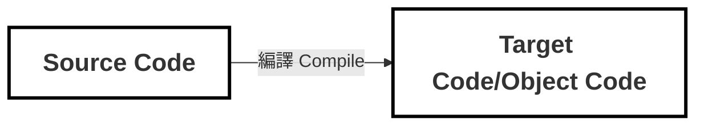

---
# try also 'default' to start simple
theme: 'seriph'
# random image from a curated Unsplash collection by Anthony
# like them? see https://unsplash.com/collections/94734566/slidev
background: https://cover.sli.dev
# some information about your slides (markdown enabled)
title: Vue.js 設計實戰
info: |
  ## Slidev Starter Template
  Presentation slides for developers.

  Learn more at [Sli.dev](https://sli.dev)
# apply UnoCSS classes to the current slide
class: text-center
# https://sli.dev/features/drawing
drawings:
  persist: false
# slide transition: https://sli.dev/guide/animations.html#slide-transitions
transition: slide-left
# enable MDC Syntax: https://sli.dev/features/mdc
mdc: true
# duration of the presentation
duration: 35min
# enable text selection and copy
selectable: true
---
<div class="flex justify-center items-center gap-4 text-green-300">
  <logos-vue class="text-4xl" />
  <h1 class="text-cyan-300">Vue.js 設計實戰</h1>
</div>
<h2>第 15 章 編譯器核心技術概覽</h2>
<p>Date: 2026/02/05</p>
<p>presenter: Hannah</p>

<div class="abs-br m-6 text-xl">
  <a href="https://github.com/HcySunYang/code-for-vue-3-book/tree/master/course6-%E7%BC%96%E8%AF%91%E5%99%A8" target="_blank" class="slidev-icon-btn">
    <carbon:logo-github />
  </a>
</div>

<!--
The last comment block of each slide will be treated as slide notes. It will be visible and editable in Presenter Mode along with the slide. [Read more in the docs](https://sli.dev/guide/syntax.html#notes)
-->


---
transition: fade-out
---


# Outline
探討 Vue.js 如何將模板 DSL 轉換為可在瀏覽器運行的 JS 渲染函數
- **15.1 模板 DSL 的編譯器**
- **15.2 parser 的實作原理與狀態機**
- **15.3 構造 AST**
- **15.4 AST 的轉換與插件化架構**
  - **15.4.1 節點的訪問**
  - **15.4.2 轉換上下文與節點的操作**
  - **15.4.3 進入與退出**
- **15.5 將模板 AST 轉為 JavaScript AST**
- **15.6 程式碼生成**
- **15.7 總結**
<br>
<br>

<style>
li {
  font-size: 22px;
}
</style>

---
transition: slide-up
level: 2
---

# 15.1 模板 DSL 的編譯器
學習重點：
- 了解什麼是編譯器
- 了解編譯流程
- AST (Abstract Syntax Tree) 抽象語法樹的特性


---

## 編譯器 Compiler
廣義的 Compiler ，其實就是把一種語言（source code）轉換成另一種語言（object code）的橋樑


```mermaid {theme: 'default'}
graph LR
  A["Source Code"]-->|編譯 Compile| B["Target Code/Object Code"]
  style A fill:#fff,stroke:#000,stroke-width:3px,font-size:22px,font-weight:bold
  style B fill:#fff,stroke:#000,stroke-width:3px,font-size:22px,font-weight:bold
```

---

## 編譯過程

編譯後端不一定會包含「中間程式碼生成」和「最佳化」這兩個環節，這取決於特定的場景和實作。這兩個環節有時也叫做「中端」。


---
layout: two-cols-header
---
<!-- TODO: 補上 DSL 解釋 -->
## DSL (Domain-Specific Language) : 領域特定語言

::left::


::right::
Vue.js 模板編譯器的目標程式碼其實就是渲染函數


<style>
.two-cols-header {
  column-gap: 20px; /* Adjust the gap size as needed */
}
</style>


---
transition: slide-up
level: 2
---
### Vue 模板編譯器的 workflow


1. Vue.js 模板編譯器會先對模板進行詞法分析和語法分析，獲得模板 AST
2. 透過「轉換器」，將模板 AST 轉成 JavaScript AST
3. 最後，根據 JavaScript AST 產生 JavaScript 程式碼，即渲染函數(目標程式碼)


<blockquote class="text-xl">
<b>AST (Abstract syntax tree) 抽象語法樹 是什麼？</b>

是一種「抽象化」的表示方式，把原始碼的語法結構以樹狀的形式呈現，隱藏了真實語法細節

樹上的每個節點都表示原始碼中的一種結構，模板 AST 其實就是用來描述模板的抽象語法樹
</blockquote>


---
layout: two-cols
layoutClass: gap-5
---

<div v-click="1">這段模板會被編譯成 AST →</div>

::left::

```html {*}{lines:true}
<div>
  <h1 v-if="ok">Vue Template</h1>
</div>
```

::right::

<div v-click="1">

<!-- TODO: Vue Template 內容不會出現在這嗎？ -->
```js {*}{lines:true}
const ast = {
  type: 'Root',
  children: [
    {
      type: 'Element',
      tag: 'div',  // <div> 節點
      children: [
        {
          type: 'Element',
          tag: 'h1',   // <h1> 標籤節點
          props: [
            // v-if 指令節點
            {
              type: 'Directive', // type 為 Directive 代表指令
              name: 'if',        // 指令名稱為 if，不帶有前綴 v-
              exp: {
                type: 'Expression',
                content: 'ok'
              }
            }
          ]
        }
      ]
    }
  ]
}
```
</div>


<!--
AST 其實就是一個有層級結構的物件。模板 AST 具有與模板同構的嵌套結構。每一棵 AST 都有一個邏輯上的根節點，type 為 Root。模板中真正的根節點則是作為 Root 節點的 children 存 在 -->


---
transition: slide-up
level: 2
---


💡 AST 小結論
<v-clicks>

1. 不同類型的節點是透過節點的 type 屬性進行區分的。例如「標籤」節點的 type 值為 `Element`
2. 標籤節點的子節點儲存在其 children 陣列中
3. 標籤節點的「屬性」節點和「指令」節點會儲存在 props 陣列中
4. 不同類型的節點會使用不同的物件屬性來描述。例如「指令」節點擁有 `name` 屬性，用來表達指令的名稱，而「表達式」節點擁有 `content` 屬性，用來描述表達式的內容

</v-clicks>


---
transition: slide-up
level: 2
layout: two-cols
layoutClass: gap-5
---
::left::
透過 `parse` 函數來完成對模板的詞法分析和語法分析，並得到模板 AST


接著透過 `transform` 函數，將模板 AST 轉成 JavaScript AST


::right::

```js {*}{lines:true}
const template = `
  <div>
    <h1 v-if="ok">Vue Template</h1>
  </div>
`

const templateAST = parse(template)
const jsAST = transform(templateAST)
```

<!--
可以看到，parse 函數接收字串模板作為參數，將解析後得到的 AST 作為回傳值傳回
接著，要將模板 AST 轉換為 JavaScript AST。因為 Vue.js 模板編譯器的最終目標是產生渲染函數，而渲染函數本質上是 JavaScript 程式碼，所以我們 需要將模板 AST 轉換成用於描述渲染函數的 JavaScript AST
-->


---
transition: slide-up
level: 2
---

## 詞法分析 V.S 語法分析

|  | 詞法分析 (Lexical Analysis) | 語法分析 (Syntax Analysis) |
| --- | --- | --- |
| **別名** | 掃描 (Scanning) | 解析 (Parsing)
| **輸入** | 原始程式碼字串 (String)） | 詞法單元流 (Tokens) |
| **輸出** | Token 列表 (扁平的)（例如：`Identifier`、`Keyword`、`Punctuator`） | AST 語法樹 (有層級的) |
| **主要工作** | 切分字元、去除無意義資訊（空白/註解）、辨識基本詞彙單元 | 依語法規則把 token 組成結構、處理優先序/結合性 |
| **比喻** | 在字典裡查每一個單字的意思 | 分析句子的主詞、動詞、受詞結構 |
| **例子** | `v-if="ok"` → `Identifier(v)` `Punctuator(-)` `Identifier(if)` ... | `Element(h1)` 搭配 `Directive(if, exp=ok)` 組成 AST 節點 |


---
transition: slide-up
level: 2
---


```js {3} {lines:true}
const templateAST = parse(template)
const jsAST = transform(templateAST)
const code = generate(jsAST)
```

全貌：


---
transition: slide-up
level: 2
---

# 15.2 parser 的實作原理與狀態機
學習重點：
- 解析器 parser 的實作原理
- 有限狀態自動機(Finite State Machine / Finite State Automaton)


---
transition: slide-up
level: 2
---


我們現在有這三樣東西
* <span v-mark.circle.orange="1">parser</span>
* transformer
* generator

<div v-click="2" class="mt-2 border border-gray-400/60 rounded-md p-4">
  解析器

  * 傳入參數：「字串模板」
  * 解析流程：
    1. 逐一讀取字串模板中的字串
    2. 根據詞法規則將字串切割為一個個 Token，這裡的 Token，又叫「詞法記號」
</div>

<div v-click="3" class="mt-2 border border-gray-400/60 rounded-md p-2">
```html {*}{lines:true}
<p>Vue</p>
```
解析器會把這段字串模板切割為三個 Token：

`<p>` 、 `Vue`、`</p>`

<!--
Vue 是文字節點
-->
</div>


---
transition: slide-up
level: 2
---


### 解析器是如何對模板進行切割的？依據什麼規則？

<p v-click class="text-2xl">→ 有限狀態自動機</p>

<p v-click>
有限狀態自動機（Finite State Automaton，簡稱 **FSA** 或 **FSM**）是一個用來描述「系統行為」的模型
</p>

<p v-click>
簡單來說，它把一個系統看作是在不同「狀態」之間切換的過程
</p>

---
transition: slide-up
level: 2
---

## 有限狀態機的核心要素

<v-clicks>

1. **狀態 (States)**：系統目前的情況
   - 例如：開、關、待機、載入中
   - 因為狀態的數量是「有限」的，所以叫有限狀態機

2. **事件/輸入 (Events/Inputs)**：觸發改變的事情
   - 例如：按下按鈕、輸入密碼、刷卡

3. **轉移 (Transitions)**：規則
   - 當「狀態 A」遇到「事件 X」時，會變成「狀態 B」

4. **初始狀態 (Start State)**：系統一開始的樣子

</v-clicks>

---
transition: slide-up
level: 2
---

## 生活中的例子：捷運閘門 🚇

<v-clicks>

- **狀態 A：鎖定 (Locked)**
- **狀態 B：解鎖 (Unlocked)**

**運作邏輯（轉移）：**

1. 目前是「鎖定」 → 投入代幣/刷卡（事件） → 變成「解鎖」
2. 目前是「解鎖」 → 人推動閘門通過（事件） → 變成「鎖定」
3. 目前是「鎖定」 → 人硬推（事件） → 維持「鎖定」（可能發出警報）

</v-clicks>

<v-click>

這就是一個簡單的狀態機。清楚知道「現在是什麼狀態」，以及「發生什麼事會變成下一個狀態」

</v-click>

---
transition: slide-up
level: 2
---

## 為什麼需要狀態機？

<v-click>

如果你不使用狀態機，你的程式碼可能會充滿大量的 `if-else` 或 `switch` 判斷，變成義大利麵程式碼（Spaghetti Code）。

</v-click>

<v-clicks>

**使用狀態機的好處：**

1. **邏輯清晰**：你把所有的可能性都畫成圖表，不會漏掉某種邊緣情況
2. **可預測性**：系統不會莫名其妙進入一個「未定義」的奇怪狀態
3. **易於除錯**：如果出錯，你只需檢查「當前狀態」和「輸入事件」是否正確

</v-clicks>


---
transition: slide-up
level: 2
---

## 常見的應用場景

<v-clicks>

1. **正規表達式 (Regex)**：其實就是一個狀態機，用來檢查字串是否符合規則
<!-- 當在寫正規的時候，其實就是在寫一個有限自動狀態機 -->

2. **編譯器 (Compiler) 與 解析器 (Parser)**

</v-clicks>

---
layout: two-cols
layoutClass: gap-5
transition: slide-up
level: 2
---

::left::

<span class="whitespace-nowrap">解析器會把這段字串模板切割為三個 Token：`<p>` 、 `Vue`、`</p>`</span>
```html {*}{lines:true}
<p>Vue</p>
```

<v-click>
解析器的狀態遷移圖：

</v-click>
::right::

<div class="flex flex-col justify-center h-full mt-4">

<!-- TODO: 確認這整個區塊 -->
<v-click>

1. **初始狀態**：解析器剛開始，還沒讀到任何內容

</v-click>

<v-click>

2. **標籤開始**：讀到 `<` 時進入此狀態，知道要開始讀標籤了

</v-click>

<v-click>

3. **標籤名稱**：讀取標籤的名稱
   - 讀完標籤名稱後遇到 `>`，有兩種情況：
     - → **狀態 1（初始）**：自閉合標籤（如 `<br/>`）或空標籤，回到初始狀態準備讀下一個
     - → **狀態 4（文本）**：有內容的標籤（如 `<p>Vue</p>`），進入文本狀態讀取標籤內容

</v-click>

<v-click>

4. **文本狀態**：讀取標籤之間的文字內容 (`Vue`)

</v-click>

<v-click>

5. **結束標籤**：讀到 `</` 符號，知道要結束標籤了

</v-click>

<v-click>

6. **結束標籤名稱**：讀取結束標籤的名稱（如 `p`）

</v-click>

<!--
- 「讀標籤名稱」
- 「讀屬性」
- 「讀內容」 -->
</div>


---
transition: slide-up
level: 2
---

解析 HTML 和產生 Token 的過程是有規範可遵循的。在 WHATWG 發布的關於瀏覽器解析 HTML 的規格中，說明了[狀態遷移](https://html.spec.whatwg.org/#data-state)


<!-- 在「初始狀態」(Data State)下，當遇到字元 < 時，狀 狀態機會遷移到 tag open state，即「標籤開始狀態」。如果遇到字符 < 以外的字符，規範中也都有對應的說明，應該讓狀態機遷移到怎樣的 狀態 -->


---
transition: slide-up
level: 2
---

有限狀態自動機可以幫助我們完成對模板的「標記化(tokenized)」
<!-- 點一下：第二段（執行結果）會出現在下方，兩段同時存在 -->
[codepen](https://codepen.io/hangineer/pen/emzrgyv)
<div class="max-h-[270px] overflow-y-auto">

```js {*}{lines:true}
// 定義狀態機的狀態
const State = {
    initial: 1,    // 初始狀態
    tagOpen: 2,    // 標籤開始狀態
    tagName: 3,    // 標籤名稱狀態
    text: 4,       // 文本狀態
    tagEnd: 5,     // 結束標籤狀態
    tagEndName: 6  // 結束標籤名稱狀態
}

// 一個輔助函式，用於判斷是否是字母
function isAlpha(char) {
    return char >= 'a' && char <= 'z' || char >= 'A' && char <= 'Z'
}

// 接收模板字串作為參數，並將模板切割為 Token 返回
function tokenize(str) {
  // 狀態機的當前狀態：初始狀態
  let currentState = State.initial
  // 用於緩存字元
  const chars = []
  // 生成的 Token 會存儲到 tokens 陣列中，並作為函式的回傳值
  const tokens = []
  // 使用 while 迴圈開啟自動機，只要模板字串沒有讀完，自動機就會一直運行
  while(str) {
    const char = str[0]
    switch (currentState) {
      // 狀態機當前處於初始狀態
      case State.initial:
        // 遇到字元 <
        if (char === '<') {
          // 1. 狀態機切換到標籤開始狀態
          currentState = State.tagOpen
          // 2. 更新當前字元 <
          str = str.slice(1)
        } else if (isAlpha(char)) {
          // 1. 遇到字母，切換到文本狀態
          currentState = State.text
          // 2. 將當前字母緩存到 chars 陣列
          chars.push(char)
          // 3. 更新當前字元
          str = str.slice(1)
        }
        break
      // 狀態機當前處於標籤開始狀態
      case State.tagOpen:
        if (isAlpha(char)) {
          // 1. 遇到字母，切換到標籤名稱狀態
          currentState = State.tagName
          // 2. 將當前字元緩存到 chars 陣列
          chars.push(char)
          // 3. 更新當前字元
          str = str.slice(1)
        } else if (char === '/') {
            // 1. 遇到字元 /，切換到結束標籤狀態
            currentState = State.tagEnd
            // 2. 更新當前字元 /
            str = str.slice(1)
        }
        break
      // 狀態機當前處於標籤名稱狀態
      case State.tagName:
        if (isAlpha(char)) {
          // 1. 遇到字母，由於當前處於標籤名稱狀態，所以不需要切換狀態，
          // 但需要將當前字元緩存到 chars 陣列
          chars.push(char)
          // 2. 更新當前字元
          str = str.slice(1)
        } else if (char === '>') {
          // 1. 遇到字元 >，切換到初始狀態
          currentState = State.initial
          // 2. 同時創建一個標籤 Token，並添加到 tokens 陣列中
          // 注意，此時 chars 陣列中緩存的字元就是標籤名稱
          tokens.push({
              type: 'tag',
              name: chars.join('')
          })
          // 3. chars 陣列的內容已經被紀錄，清空它
          chars.length = 0
          // 4. 同時更新當前字元 >
          str = str.slice(1)
        }
        break
        // 狀態機當前處於文本狀態
        case State.text:
          if (isAlpha(char)) {
            // 1. 遇到字母，保持狀態不變，但應該將當前字元緩存到 chars 陣列
            chars.push(char)
            // 2. 更新當前字元
            str = str.slice(1)
          } else if (char === '<') {
            // 1. 遇到字元 <，切換到標籤開始狀態
            currentState = State.tagOpen
            // 2. 從 文本狀態 --> 標籤開始狀態，此時應該創建文本 Token，並添加到 tokens 陣列
            // 注意，此時 chars 陣列中的字元就是文本內容
            tokens.push({
                type: 'text',
                content: chars.join('')
            })
            // 3. chars 陣列的內容已經被紀錄，清空它
            chars.length = 0
            // 4. 更新當前字元
            str = str.slice(1)
          }
        break
        // 狀態機當前處於標籤結束狀態
        case State.tagEnd:
          if (isAlpha(char)) {
            // 1. 遇到字母，切換到結束標籤名稱狀態
            currentState = State.tagEndName
            // 2. 將當前字元緩存到 chars 陣列
            chars.push(char)
            // 3.更新當前字元
            str = str.slice(1)
          }
        break
        // 狀態機當前處於結束標籤名稱狀態
        case State.tagEndName:
          if (isAlpha(char)) {
            // 1. 遇到字母，不需要切換狀態，但需要將當前字元緩存到 chars 陣列
            chars.push(char)
            // 2. 更新當前字元
            str = str.slice(1)
          } else if (char === '>') {
            // 1. 遇到字元 >，切換到初始狀態
            currentState = State.initial
            // 2. 從 結束標籤名稱狀態 --> 初始狀態，應該保存結束標籤名稱 Token
            // 注意，此時 chars 陣列中緩存的內容就是標籤名稱
            tokens.push({
                type: 'tagEnd',
                name: chars.join('')
            })
            // 3. chars 陣列的內容已經被紀錄，清空它
            chars.length = 0
            // 4. 更新當前字元
            str = str.slice(1)
          }
        break
    }
  }
  return tokens
}
```

</div>

<div v-click class="mt-4">

```js {*}{lines:true}
const tokens = tokenize(`<p>Vue</p>`)
// [
//   { type: 'tag', name: 'p' },   // 開始標籤
//   { type: 'text', content: 'Vue' }, // 文本節點
//   { type: 'tagEnd', name: 'p' } // 結束標籤
// ]
```

</div>


<!-- 我們並非總是需要所有 Token。例如，在解析模板的過程中，結束標籤 Token 可以 省略。有時我們可能需要更多的 Token，這取決於具體的需求
總而言之，透過有限自動機，我們能夠將模板解析為一個個 Token，進而可以用它們建構一棵 AST 了。但在具體建構 AST 之前， 我們需要思考能否簡化 tokenize 函數的程式碼。實際上，我們可以通 過正規表示式來精簡 tokenize 函數的程式碼。上文之所以沒有從最開 -->


---
transition: slide-up
level: 2
---


# 15.3 構造 AST

學習重點：
- 如何將 Token 列表轉換為樹狀結構的模板 AST


<br />

不同用途的編譯器之間可能會有非常大的差異。唯一的共同點是，都會將「原始碼」→「目標程式碼」

- JavaScript 等腳本語言：構造 AST 常用遞迴下降演算法，需處理運算子優先級等問題
- Vue.js 模板 DSL：DSL 不要求圖靈完備，只需滿足特定場景；通用用途語言(GPL) 可實作 DSL
- Vue 模板建 AST 較簡單：HTML 標籤格式固定、天然嵌套成父子關係，對應的 AST 與 HTML 結構相似

P.S 圖靈完備：簡單來說，能愈來寫各種程式邏輯的語言就是圖靈完備


<!-- 編譯器共通點是「原始碼 → 目標程式碼」；Vue 模板因 HTML 標籤嵌套固定， AST 建構比一般程式語言簡單 -->

---
transition: slide-up
level: 2
---

HTML 是一種標記語言，格式非常固定。 因此，HTML 的 AST 將擁有與 HTML 標籤非常類似的崁套結構

```html {*}{lines:true}
<div>
  <p>Vue</p>
  <p>Template</p>
</div>
```
<div class="max-h-[340px] overflow-y-auto">
```js {*}{lines:true}
const ast = {
  type: 'Root', // 根節點
  children: [
    {
      type: 'Element',
      tag: 'div',
      children: [
        {
          type: 'Element',
          tag: 'p', // 第一個子節點
          children: [
            {
              type: 'Text',
              content: 'Vue'
            }
          ]
        },
        {
          type: 'Element',
          tag: 'p', // 第二個子節點
          children: [
            {
              type: 'Text',
              content: 'Template'
            }
          ]
        }
      ]
    }
  ]
}
```
</div>


---
transition: slide-up
level: 2
---

了解了 AST 的結構，接下來是使用 Token 構造出一棵 AST

<!-- tokenize 函數 -->
拿上一節的 tokenize 函數來用

```js {*}{lines:true}
const tokens = tokenize(`<div><p>Vue</p><p>Template</p></div>`)
```

會得到如下的結果
```js {*}{lines:true}
const tokens = [
  { type: "tag", name: "div" },
  { type: "tag", name: "p" },
  { type: "text", content: "Vue" },
  { type: "tagEnd", name: "p" },
  { type: "tag", name: "p" },
  { type: "text", content: "Template" },
  { type: "tagEnd", name: "p" },
  { type: "tagEnd", name: "div" }
]
```


我們需要處理每個 tokens，在這個過程中，需要建立一個堆疊 `elementStack`，用於維護元素間的父子關係。每遇到一個「開始標籤」節點，就會建立一個 Element 的 AST 節點，並將其寫入堆疊中。遇到一個「結束標籤」節點，就會彈出目前棧頂的節點

---
transition: slide-up
level: 2
---


<!-- 這樣，棧頂的節點 = 父節點。掃描過程 中遇到的所有節點，都會作為目前棧頂節點的子節點，並加入到棧頂 節點的 children 屬性下。 -->

# elementStack 與 AST 建構過程

<div class="grid grid-cols-3 gap-6 text-xs mt-4">

<div>
<div class="text-center font-bold mb-3 text-base">↓ 掃描 Token</div>
<div class="space-y-1.5 font-mono text-xs">
  <div v-click class="px-2 py-1 border-2 border-dashed border-gray-400 rounded text-center bg-amber-500/10">開始標籤(div)</div>
  <div v-click class="px-2 py-1 border-2 border-dashed border-gray-400 rounded text-center bg-amber-500/10">開始標籤(p)</div>
  <div v-click class="px-2 py-1 border-2 border-dashed border-gray-400 rounded text-center bg-amber-500/10">文本(Vue)</div>
  <div v-click class="px-2 py-1 border-2 border-dashed border-gray-400 rounded text-center bg-amber-500/10">結束標籤(p)</div>
  <div v-click class="px-2 py-1 border-2 border-dashed border-gray-400 rounded text-center bg-amber-500/10">開始標籤(p)</div>
  <div v-click class="px-2 py-1 border-2 border-dashed border-gray-400 rounded text-center bg-amber-500/10">文本(Template)</div>
  <div v-click class="px-2 py-1 border-2 border-dashed border-gray-400 rounded text-center bg-amber-500/10">結束標籤(p)</div>
  <div v-click class="px-2 py-1 border-2 border-dashed border-gray-400 rounded text-center bg-amber-500/10">結束標籤(div)</div>
</div>
</div>

<div>
<div class="text-center font-bold mb-3 text-base">elementStack</div>
<div class="flex flex-col items-center">
<div class="w-36 h-64 border-2 border-dashed border-cyan-500/50 flex flex-col-reverse items-center pb-3 px-3">
  <div class="w-full text-center py-1.5 bg-gray-700 rounded-full text-white text-xs mt-1.5">Root</div>
  <div v-if="$clicks >= 1 && $clicks <= 7" class="w-full text-center py-1.5 bg-cyan-600 rounded-full text-white text-xs mt-1.5">div</div>
  <div v-if="$clicks >= 2 && $clicks <= 3" class="w-full text-center py-1.5 bg-cyan-500 rounded-full text-white text-xs mt-1.5">p</div>
  <div v-if="$clicks >= 5 && $clicks <= 6" class="w-full text-center py-1.5 bg-cyan-500 rounded-full text-white text-xs mt-1.5">p</div>
</div>
</div>
</div>

<div>
<div class="text-center font-bold mb-3 text-base">AST</div>
<div class="flex justify-center">
<div class="font-mono" style="font-size: 10px;">
  <div class="flex flex-col items-center">
    <div class="px-2 py-1 bg-gray-700 rounded-full text-white">Root</div>
    <div v-click="1" class="w-0.5 h-3 bg-gray-400"></div>
    <div v-click="1" class="px-2 py-1 bg-gray-600 rounded-full text-white">Element(div)</div>
    <div v-click="2" class="w-0.5 h-2 bg-gray-400"></div>
    <div v-click="2" class="flex gap-4">
      <div class="flex flex-col items-center">
        <div class="px-2 py-1 bg-gray-600 rounded-full text-white">Element(p)</div>
        <div v-click="3" class="w-0.5 h-2 bg-gray-400"></div>
        <div v-click="3" class="px-2 py-1 bg-gray-500 rounded-full text-white">Text(Vue)</div>
      </div>
      <div v-click="5" class="flex flex-col items-center">
        <div class="px-2 py-1 bg-gray-600 rounded-full text-white">Element(p)</div>
        <div v-click="6" class="w-0.5 h-2 bg-gray-400"></div>
        <div v-click="6" class="px-2 py-1 bg-gray-500 rounded-full text-white">Text(Template)</div>
      </div>
    </div>
  </div>
</div>
</div>
</div>

</div>

<div v-click class="mt-10 text-center text-xs opacity-70">
💡 開始標籤 → push 進堆疊；結束標籤 → pop 出堆疊；文本 → 掛到棧頂的 children
</div>


---
transition: slide-up
level: 2
---
掃描 Token 清單並建構 AST 的具體實作如下:

[codepen](https://codepen.io/hangineer/pen/YPWLZaP)

<div class="max-h-[400px] overflow-y-auto">

```js {*}{lines:true}
// parse 函式接收模板作為參數
function parse(str) {
  // 首先對模板進行標記化，得到 tokens
  const tokens = tokenize(str)

  // 創建 Root 根節點
  const root = {
    type: 'Root',
    children: []
  }

  // 創建 elementStack 堆疊，起初只有 Root 根節點
  const elementStack = [root]

  // 開啟一個 while 迴圈掃描 tokens，直到所有 Token 都被掃描完畢為止
  while (tokens.length) {
    // 獲取當前堆疊頂端節點作為父節點 parent
    const parent = elementStack[elementStack.length - 1]
    // 當前掃描的 Token
    const t = tokens[0]

    switch (t.type) {
      case 'tag':
        // 如果當前 Token 是開始標籤，則創建 Element 類型的 AST 節點
        const elementNode = {
          type: 'Element',
          tag: t.name,
          children: []
        }
        // 將其添加到父級節點的 children 中
        parent.children.push(elementNode)
        // 將當前節點壓入堆疊
        elementStack.push(elementNode)
        break
      case 'text':
        // 如果當前 Token 是文本，則創建 Text 類型的 AST 節點
        const textNode = {
          type: 'Text',
          content: t.content
        }
        // 將其添加到父節點的 children 中
        parent.children.push(textNode)
        break
      case 'tagEnd':
        // 遇到結束標籤，將堆疊頂端節點彈出
        elementStack.pop()
        break
    }
    // 消費已經掃描過的 token
    tokens.shift()
  }

  // 最後返回 AST
  return root
}
```

</div>

<!-- 目前的實作仍然存在諸多問題，例如無法處理自閉合標籤等。這些問題會在第 16 章詳細講解 -->


---
transition: slide-up
level: 2
---

# 15.4 AST 的轉換與插件化架構
學習重點：
- 關於 AST 的轉換
- 如何對 AST 進行新增、刪除、修改、查詢

---
transition: slide-up
level: 2
---


## 15.4.1 節點的訪問


為了對 AST 進行轉換，我們需要存取 AST 的每一個節點，這樣
才有機會對特定節點進行修改等操作

---
transition: slide-up
level: 2
---

<!-- 由於 AST 是樹狀資料結構，所以我們需要寫一個「深度優先」的遍歷演算法，實現對 AST 中節點的存取。 -->
### 第一步：寫一個 `dump` 函式
用來找出目前 AST 中節點的資訊，如下面的程式碼所示：

<div class="max-h-[400px] overflow-y-auto">

```js {*}{lines:true}
function dump(node, indent = 0) {
  // 節點的類型
  const type = node.type


  const desc = node.type === 'Root'
    ? ''
    : node.type === 'Element'
      ? node.tag
      : node.content

  console.log(`${'-'.repeat(indent)}${type}: ${desc}`)

  // 印出子節點
  if (node.children) {
    node.children.forEach(n => dump(n, indent + 2))
  }
}

// 執行
const ast = parse(`<div><p>Vue</p><p>Template</p></div>`)
dump(ast)


/*
  執行結果
  Root:
    --Element: div
    ----Element: p
    ------Text: Vue
    ----Element: p
    ------Text: Template
*/
```
</div>

<!--
  節點的描述，如果是根節點，則沒有描述
  如果是 Element 類型的節點，則使用 node.tag 作為節點的描述
  如果是 Text 類型的節點，則使用 node.content 作為節點的描述
-->


---
transition: slide-up
level: 2
---
### 第二步：實現對 AST 中節點的存取
訪問節點的方式：從 AST 根節點開始，進行深度優先遍歷

````md magic-move {lines: true}
```js
function traverseNode(ast) {
  const currentNode = ast // ast 本身就是 Root 節點
  // 如果有子節點，則遞迴呼叫 traverseNode
  const children = currentNode.children
  if (children) {
    for (let i = 0; i < children.length; i++) {
      traverseNode(children[i])
    }
  }
}
```

```js
function traverseNode(ast) {
  // 當前節點，ast 本身就是 Root 節點
  const currentNode = ast

  // 對當前節點進行操作
  if (currentNode.type === 'Element' && currentNode.tag === 'p') {
    // 將所有 p 標籤轉換為 h1 標籤
    currentNode.tag = 'h1'
  }

  // 如果有子節點，則遞迴地呼叫 traverseNode 函式進行遍歷
  const children = currentNode.children
  if (children) {
    for (let i = 0; i < children.length; i++) {
      traverseNode(children[i])
    }
  }
}
```
````

<!-- 有了 traverseNdoe 函數之後，我們即可實現對 AST 中節點的存取。例如，我們可以實現一個轉換功能，將 AST 中所有 p 標籤轉換為 h1 標籤 -->


---
transition: slide-up
level: 2
---

<div class="max-h-[400px] overflow-y-auto">

### 第三步：封装 transform 函数，用來對 AST進行轉換

```js {*}{lines:true}
function transform(ast) {
  traverseNode(ast)
  console.log(dump(ast))
}

const ast = parse(`<div><p>Vue</p><p>Template</p></div>`)
transform(ast)

/*
  執行結果
  Root:
    --Element: div
    ----Element: h1
    ------Text: Vue
    ----Element: h1
    ------Text: Template
*/
```
</div>

---
transition: slide-up
level: 2
---

潛在問題：隨著功能的不斷增加（進行更多的操作），traverseNode 可能會變得越來越「臃腫」

<div v-click>能否對節點的操作和存取進行解耦呢？</div>

<div v-click class="text-orange-500">使用回調函數的機制來實現解耦</div>

<div v-click>

```js {*}{lines:true}
// 接收第二個參數 context，context 內容後面會談到
function traverseNode(ast, context) {
  const currentNode = ast

  // context.nodeTransforms 是一個陣列，其中每一個元素都是一個函式
  const transforms = context.nodeTransforms
  for (let i = 0; i < transforms.length; i++) {
    // 將當前節點 currentNode 和 context 都傳遞給 nodeTransforms 中註冊的回調函式
    transforms[i](currentNode, context)
  }

  const children = currentNode.children
  if (children) {
    for (let i = 0; i < children.length; i++) {
      traverseNode(children[i], context)
    }
  }
}
```
</div>


---
transition: slide-up
level: 2
---

<div class="max-h-[400px] overflow-y-auto">

```js {*}{lines:true}
function transform(ast) {
  // 在 transform 函式內建立 context 物件
  const context = {
    nodeTransforms: [
      transformElement, // transformElement 用來轉換標籤節點
      transformText // transformText 用來轉換文本節點
    ]
  }
  // 透過 traverseNode 完成轉換
  traverseNode(ast, context)
  // 印出 AST 資訊
  console.log(dump(ast))
}

function transformElement(node) {
  if (node.type === 'Element' && node.tag === 'p') {
    node.tag = 'h1'
  }
}

function transformText(node) {
  if (node.type === 'Text') {
    node.content = node.content.repeat(2)
  }
}
```
</div>

<!-- 可以看到，解耦之後，節點操作封裝到了 transformElement 和 transformText 中。甚至可以編寫任意多個類似的轉換函數，只需要將它們註冊到 context.nodeTransforms 中即可。這樣就解決了功能增加所導致的 traverseNode 函數“臃腫”的問題 -->


---
transition: slide-up
level: 2
---

## 15.4.2 轉換上下文與節點操作
可以把 Context 看作程式在某個範圍內的「全域變數」
上小節提到的 context.nodeTransforms 陣列，這裡的 context 可以看作 AST 轉換函數過程中的上下文資料。所有 AST 轉換函數都可以透過 context 來共享資料

```js {*}{lines:true}
function transform(ast) {
  const context = {
    nodeTransforms: [
      transformElement, // transformElement 用來轉換標籤節點
      transformText // transformText 用來轉換文本節點
    ]
  }
  // ... 略 ...
}
```

---
transition: slide-up
level: 2
---

context 包含當前狀態

例如：\
當前轉換的節點是哪一個?\
當前轉換的節點的父節點是誰?\
當前節點是父節點的第幾個子節點?
<!-- 這些資訊 對於編寫複雜的轉換函數非常有用，如下面的程式碼所示: -->
<div class="max-h-[400px] overflow-y-auto">

```js {*}{lines:true}
function transform(ast) {
  const context = {
    // 增加 currentNode，儲存當前正在轉換的節點
    currentNode: null,
    // 增加 childIndex，儲存當前節點在父節點的 children 中的位置索引
    childIndex: 0,
    // 增加 parent，用來儲存當前轉換節點的父節點
    parent: null,
    nodeTransforms: [
      transformElement,
      transformText
    ]
  }

  traverseNode(ast, context)
  console.log(dump(ast))
}
```
</div>


---
transition: slide-up
level: 2
---

接著，透過 traverseNode 完成轉換
<div class="max-h-[400px] overflow-y-auto">

```js {*}{lines:true}
function traverseNode(ast, context) {
  // 設定當前轉換的節點資訊 context.currentNode
  context.currentNode = ast

  const transforms = context.nodeTransforms
  for (let i = 0; i < transforms.length; i++) {
    transforms[i](context.currentNode, context)
  }

  const children = context.currentNode.children
  if (children) {
    for (let i = 0; i < children.length; i++) {
      // 將當前節點設定為父節點
      context.parent = context.currentNode
      context.childIndex = i
      traverseNode(children[i], context)
    }
  }
}
```
</div>

<!-- 上面這段程式碼，其關鍵點在於，在遞歸地調用
traverseNode 函數在進行子節點的轉換之前，必須先設定
context.parent 和 context.childIndex 的值，這樣才能保證
在接下來的遞歸轉換中，context 物件儲存的資訊是正確的 -->


---
transition: slide-up
level: 2
---

### 替換節點 `context.replaceNode`
將所有文字節點替換成一個元素節點
```js {*}{lines:true}
function transform(ast) {
  const context = {
    currentNode: null,
    parent: null,
    // 用於替換節點的函式，接收新節點作為參數
    replaceNode(node) {
      // 為了替換節點，我們需要修改 AST
      // 找到當前節點在父節點的 children 中的位置：context.childIndex
      // 然後使用新節點替換即可
      context.parent.children[context.childIndex] = node
      // 由於當前節點已經被新節點替換掉了，因此我們需要將 currentNode 更新為新節點
      context.currentNode = node
    },
    nodeTransforms: [
      transformElement,
      transformText
    ]
  }

  traverseNode(ast, context)
  console.log(dump(ast))
}
```


---
transition: slide-up
level: 2
---

在 transformText 轉換函式中使用 replaceNode 對 AST 中的節點進行替換
```js {*}{lines:true}
function transformText(node, context) {
  if (node.type === 'Text') {
    context.replaceNode({
      type: 'Element',
      tag: 'span'
    })
  }
}
```

節點轉換範例：[codepen](https://codepen.io/hangineer/pen/dPXegBz?editors=1111)

---
transition: slide-up
level: 2
---

### 刪除節點 `context.removeNode`

```js {*}{lines:true}
function transform(ast) {
  const context = {
    currentNode: null,
    parent: null,
    replaceNode(node) {
      context.currentNode = node
      context.parent.children[context.childIndex] = node
    },
    // 刪除當前節點
    removeNode() {
      if (context.parent) {
        context.parent.children.splice(context.childIndex, 1)
        context.currentNode = null
      }
    },
    nodeTransforms: [
      transformElement,
      transformText
    ]
  }

  traverseNode(ast, context)
  dump(ast)
}
```

---
transition: slide-up
level: 2
---

由於節點被刪除了，所以後續的轉換函數將不再需要處理該節點。
因此，需要對 `traverseNode` 函數做一些調整

```js {*}{lines:true}
function traverseNode(ast, context) {
  context.currentNode = ast

  const transforms = context.nodeTransforms
  for (let i = 0; i < transforms.length; i++) {
    transforms[i](context.currentNode, context)
    // 由於任何轉換函式都可能移除當前節點，因此每個轉換函式執行完畢後，
    // 都應該檢查當前節點是否已經被移除，如果被移除了，直接返回即可
    if (!context.currentNode) return
  }

  const children = context.currentNode.children
  if (children) {
    for (let i = 0; i < children.length; i++) {
      context.parent = context.currentNode
      context.childIndex = i
      traverseNode(children[i], context)
    }
  }
}
```

刪除節點範例：[codepen](https://codepen.io/hangineer/pen/yyJjQOy?editors=1111)


---
transition: slide-up
level: 2
---

## 15.4.3 進入與退出
上面的轉換流程，是一種從根節點開始、順序執行的工作流程 (先序遍歷 top-down)


<div v-click="1">如果需要根據子節點的情況來決定如何對目前節點進行轉換，就會遇到問題</div>

<span v-click="2" style="font-size: 20px; color: orange;">簡單來說就是，沒辦法後序遍歷 (bottom-up)</span>

<!-- 無法再回過頭重新處理父節點 -->

---
transition: slide-up
level: 2
layout: two-cols
layoutClass: gap-5
---

::left::

更理想的流程會像下圖


::right::

<div v-click="1" class="mt-4">
節點的存取分為兩個階段：

1. 進入
2. 退出
</div>

<!-- 當轉換函數處於進入階段時，它會先進入父節點，再進入子節
點。而當轉換函數處於退出階段時，則會先退出子節點，再退出父節
點。這樣，只要我們在「退出節點階段」對目前存取的節點進行處理，就
一定能夠保證其子節點全部處理完畢 -->


---
transition: slide-up
level: 2
---

需要重新設計轉換函式，如下面 traverseNode
<div class="max-h-[400px] overflow-y-auto">

```js {*}{lines:true}
function traverseNode(ast, context) {
  context.currentNode = ast
  // 1. 增加退出階段的回調函式陣列
  const exitFns = []
  const transforms = context.nodeTransforms
  for (let i = 0; i < transforms.length; i++) {
    // 2. 轉換函式可以返回另外一個函式，該函式即作為退出階段的回調函式
    const onExit = transforms[i](context.currentNode, context)
    if (onExit) {
      // 將退出階段的回調函式添加到 exitFns 陣列中
      exitFns.push(onExit)
    }
    if (!context.currentNode) return
  }

  const children = context.currentNode.children
  if (children) {
    for (let i = 0; i < children.length; i++) {
      context.parent = context.currentNode
      context.childIndex = i
      traverseNode(children[i], context)
    }
  }

  // 在節點處理的最後階段執行緩存到 exitFns 中的回調函式
  // 要反序執行
  let i = exitFns.length
  while (i--) {
    exitFns[i]()
  }
}
```
</div>

<!-- 這樣就保證了，當退出階段的回呼函數執行時，當前訪問的節點
的子節點已經全部處理過了。
我們在寫轉換函數時，可以將轉換邏輯編寫在退出階段的回調函數中，
從而保證在對目前存取的節點進行轉換之前，其子節點一定全部處理完畢了 -->


---
transition: slide-up
level: 2
---

```js {*}{lines:true}
function transformElement(node, context) {
  // 進入節點

  // 回傳一個會在退出節點時執行的回呼函數
  return () => {
    // 在這裡編寫退出節點的邏輯，當這裡的代碼運行時，當前轉換節點的子節點一定處理完畢了
  };
}
```
退出階段的回呼函數是反序執行的

假設註冊了兩個轉換函數分別是 transformA 和 transformB
* transformA 比 transformB 更早被註冊
* transformA 的「進入階段」會先於 transformB 的「進入階段」
* transformA 的「退出階段」將晚於 transformB 的「退出階段」

進入與退出範例：[codepen](https://codepen.io/hangineer/pen/yyJjQmM?editors=1012)


---
transition: slide-up
level: 2
---

# 15.5 將模板 AST 轉為 JavaScript AST
學習重點：
- 如何將模板 AST 轉換為 JavaScript AST


---
transition: slide-up
level: 2
---
為什麼要將模板 AST 轉換為 JavaScript AST 呢？


<p v-click>因為需要將模板編譯為渲染函數</p>

<!-- 因為 需要將模板編譯為渲染函數 -->

---
transition: slide-up
level: 2
---

```html {*}{lines:true}
<div>
  <h1 :id="dynamicId">Vue Template</h1>
</div>
```

與上面等價的渲染函式：
```js {*}{lines:true}
function render() {
  return h('div', [
    h('h1', { id: dynamicId }, 'Vue Template' )
  ])
}
```

這段渲染函式的 JavaScript 所對應的 JavaScript AST 就是
轉換目標。JavaScript AST 是 JavaScript 程式碼的描述

<!-- 觀察上面這段渲染函數的程式，他是一個函式宣告語句
所以，需要設計一些資料結構來描述 JavaScript 中的函式宣告語句 -->

一個函式宣告語句，由以下幾部分組成：
1. id：函式名稱，是一個 Identifier
2. params：函式的參數，是一個陣列
3. body：函式體，可以包含多個語句，因此也是一個陣列

<!-- 為了簡化問題，這裡不考慮箭頭函數、非同步等情況。那麼，根據以上這些信息，我們就可以設計一個基本的資料結構來描述函數宣告語句： -->

---
transition: slide-up
level: 2
---


```js
const FunctionDeclNode = {
  type: 'FunctionDecl', // 代表該節點是函式宣告
  // 函式的名稱是一個識別碼，識別碼本身也是一個節點
  id: {
    type: 'Identifier',
    name: 'render' // name 用來儲存識別碼的名稱，在這裡它就是渲染函式的名稱 render
  },
  params: [], // 參數，目前渲染函式還不需要參數，所以這裡是一個空陣列
  // 渲染函式的函式體只有一個語句，即 return 語句
  body: [
    {
      type: 'ReturnStatement',
      return: null // 暫時留空，在後續講解中補全
    }
  ]
};
```


---
transition: slide-up
level: 2
---

### 渲染函式的回傳值
```js {*|2,3,4,5}{lines:true}
function render() {
  return h('div', [
    h('h1', { id: dynamicId }, 'Vue Template' )
  ])
}
```

<div v-click="1" v-if="$clicks < 2">
渲染函式的回傳值是虛擬 DOM 節點，可以使用 CallExpression 類型的節點來描述函式呼叫語句
```js {*}{lines:true}
const CallExp = {
  type: 'CallExpression',
  // 被呼叫函式的名稱，它是一個識別碼
  callee: {
    type: 'Identifier',
    name: 'h'
  },
  // 參數
  arguments: []
};
```
</div>


<div v-click="2">
最外層 h 函式的第一個參數是一個字串字面量，第二個參數是一個陣列

```js {*}{lines:true}
const Str = {
  type: 'StringLiteral',
  value: 'div'
};

const Arr = {
  type: 'ArrayExpression',
  // 陣列中的元素
  elements: []
};
```
</div>


---
transition: slide-up
level: 2
---

合併起來的結果

<div class="max-h-[400px] overflow-y-auto">

```js {*}{lines:true}
function render() {
  return h('div', [
    h('p', 'Vue'),
    h('p', 'Template')
  ])
}

// JavaScript AST
const FunctionDeclNode = {
  type: 'FunctionDecl',
  id: {
    type: 'Identifier',
    name: 'render'
  },
  params: [],
  body: [
    {
      type: 'ReturnStatement',
      // 最外層的 h 函式呼叫
      return: {
        type: 'CallExpression',
        callee: { type: 'Identifier', name: 'h' },
        arguments: [
          // 第一個參數是字串字面量 'div'
          {
            type: 'StringLiteral',
            value: 'div'
          },
          // 第二個參數是一個陣列
          {
            type: 'ArrayExpression',
            elements: [
              // 陣列的第一個元素是 h 函式的呼叫
              {
                type: 'CallExpression',
                callee: { type: 'Identifier', name: 'h' },
                arguments: [
                  // 該 h 函式呼叫的第一個參數是字串字面量
                  { type: 'Identifier', value: 'p' }, // 註：此處原意應為標籤名
                  { type: 'StringLiteral', value: 'p' },
                  // 第二個參數也是一個字串字面量
                  { type: 'StringLiteral', value: 'Vue' }
                ]
              },
              // 陣列的第二個元素也是 h 函式的呼叫
              {
                type: 'CallExpression',
                callee: { type: 'Identifier', name: 'h' },
                arguments: [
                  // 該 h 函式呼叫的第一個參數是字串字面量
                  { type: 'StringLiteral', value: 'p' },
                  // 第二個參數也是一個字串字面量
                  { type: 'StringLiteral', value: 'Template' }
                ]
              }
            ]
          }
        ]
      }
    }
  ]
};
```
</div>

---
transition: slide-up
level: 2
---

接下來要寫轉換函式，將模板 AST 轉換為上一頁的 JavaScript AST
<div class="max-h-[400px] overflow-y-auto">

```js {*}{lines:true}
// 用來建立 StringLiteral 節點
function createStringLiteral(value) {
  return {
    type: 'StringLiteral',
    value
  };
}

// 用來建立 Identifier 節點
function createIdentifier(name) {
  return {
    type: 'Identifier',
    name
  };
}

// 用來建立 ArrayExpression 節點
function createArrayExpression(elements) {
  return {
    type: 'ArrayExpression',
    elements
  };
}

// 用來建立 CallExpression 節點
function createCallExpression(callee, arguments) {
  return {
    type: 'CallExpression',
    callee: createIdentifier(callee),
    arguments
  };
}

// 轉換文本節點
function transformText(node) {
  // 如果不是文本節點，則什麼都不做
  if (node.type !== 'Text') {
    return;
  }

  // 文本節點對應的 JavaScript AST 節點其實就是一個字串字面量，
  // 因此只需要使用 node.content 建立一個 StringLiteral 類型的節點即可
  // 最後將文本節點對應的 JavaScript AST 節點添加到 node.jsNode 屬性下
  node.jsNode = createStringLiteral(node.content);
}

// 轉換標籤節點
function transformElement(node) {
  // 將轉換程式碼編寫在退出階段的回調函式中，
  // 這樣可以保證該標籤節點的子節點全部被處理完畢
  return () => {
    // 如果被轉換的節點不是元素節點，則什麼都不做
    if (node.type !== 'Element') {
      return;
    }

    // 1. 建立 h 函式呼叫語句
    // h 函式呼叫的第一個參數是標籤名稱，因此我們以 node.tag 來建立一個字串字面量節點
    // 作為第一個參數
    const callExp = createCallExpression('h', [
      createStringLiteral(node.tag)
    ]);

    // 2. 處理 h 函式呼叫的參數
    node.children.length === 1
      // 如果當前標籤節點只有一個子節點，則直接使用子節點的 jsNode 作為參數
      ? callExp.arguments.push(node.children[0].jsNode)
      // 如果當前標籤節點有多個子節點，則建立一個 ArrayExpression 節點作為參數
      : callExp.arguments.push(
          // 陣列的每個元素都是子節點的 jsNode
          createArrayExpression(node.children.map(c => c.jsNode))
        );

    // 3. 將當前標籤節點對應的 JavaScript AST 添加到 jsNode 屬性下
    node.jsNode = callExp;
  };
}

// 轉換 Root 根節點
function transformRoot(node) {
  // 將邏輯編寫在退出階段的回調函式中，保證子節點全部被處理完畢
  return () => {
    // 如果不是根節點，則什麼都不做
    if (node.type !== 'Root') {
      return;
    }
    // node 是根節點，根節點的第一個子節點就是模板的根節點，
    // 當然，這裡我們暫時不考慮模板存在多個根節點的情況
    const vnodeJSAST = node.children[0].jsNode;
    // 建立 render 函式的宣告語句節點，將 vnodeJSAST 作為 render 函式體的回傳語句
    node.jsNode = {
      type: 'FunctionDecl',
      id: { type: 'Identifier', name: 'render' },
      params: [],
      body: [
        {
          type: 'ReturnStatement',
          return: vnodeJSAST
        }
      ]
    };
  };
}
```

</div>

<!-- 模板 AST 將轉換為對應的 JavaScript
AST，並且可以透過根節點的 node.jsNode 來存取轉換後的
JavaScript AST -->


---
transition: slide-up
level: 2
---

# 15.6 程式碼生成
學習重點：
- 根據轉換後得到的 JavaScript AST 產生渲染函式程式碼
- 實作 generate 函數來完成程式碼生成


---
transition: slide-up
level: 2
---

程式碼生成是編譯器的「最後一步」，與 AST 轉換一樣，程式碼產生成也需要 context

```js {*}{lines:true}
function compile(template) {
  // 模板 AST
  const ast = parse(template);

  // 將模板 AST 轉換為 JavaScript AST
  transform(ast);

  // 程式碼生成
  const code = generate(ast.jsNode);

  return code;
}
```

```js {*}{lines:true}
function generate(node) {
  const context = {
    // 儲存最終生成的渲染函式程式碼
    code: '',
    // 在生成程式碼時，透過呼叫 push 函式完成程式碼的拼接
    push(code) {
      context.code += code;
    },
    // 目前縮排的層級，初始值為 0，即沒有縮排
    currentIndent: 0,

    // 該函式用來換行，即在程式碼字串的後面追加 \n 字元，
    // 另外，換行時應該保留縮排，所以我們還要追加 currentIndent * 2 個空格字元
    newline() {
      context.code += '\n' + ` `.repeat(context.currentIndent * 2);
    },

    // 用來縮排，即讓 currentIndent 自增後，呼叫換行函式
    indent() {
      context.currentIndent++;
      context.newline();
    },

    // 取消縮排，即讓 currentIndent 自減後，呼叫換行函式
    deIndent() {
      context.currentIndent--;
      context.newline();
    }
  };

  // 呼叫 genNode 函式完成程式碼生成的工作
  genNode(node, context);

  // 回傳渲染函式程式碼
  return context.code;
}
```


---
transition: slide-up
level: 2
---
程式碼生成的原理只需要搭配各種類型的 JavaScript AST 節點，並呼叫對應的生成函式就好

<div class="max-h-[400px] overflow-y-auto">

```js {*}{lines:true}
function genNode(node, context) {
  switch (node.type) {
    case 'FunctionDecl':
      genFunctionDecl(node, context);
      break;
    case 'ReturnStatement':
      genReturnStatement(node, context);
      break;
    case 'CallExpression':
      genCallExpression(node, context);
      break;
    case 'StringLiteral':
      genStringLiteral(node, context);
      break;
    case 'ArrayExpression':
      genArrayExpression(node, context);
      break;
  }
}

function genFunctionDecl(node, context) {
  // 從 context 物件中取出工具函式
  const { push, indent, deIndent } = context;

  // node.id 是一個識別碼，用來描述函式的名稱，即 node.id.name
  push(`function ${node.id.name} `);
  push(`(`);

  // 呼叫 genNodeList 為函式的參數生成程式碼
  genNodeList(node.params, context);

  push(`) `);
  push(`{`);

  // 縮排
  indent();

  // 為函式體生成程式碼，這裡遞迴地呼叫了 genNode 函式
  node.body.forEach(n => genNode(n, context));

  // 取消縮排
  deIndent();

  push(`}`);
}

function genNodeList(nodes, context) {
  const { push } = context;
  for (let i = 0; i < nodes.length; i++) {
    const node = nodes[i];
    // 遞迴呼叫 genNode 生成單個節點的程式碼
    genNode(node, context);
    // 如果不是最後一個節點，則補充逗號和空格
    if (i < nodes.length - 1) {
      push(', ');
    }
  }
}

function genArrayExpression(node, context) {
  const { push } = context;
  // 追加方括號
  push('[');
  // 呼叫 genNodeList 為陣列元素生成程式碼
  genNodeList(node.elements, context);
  // 補全方括號
  push(']');
}

function genReturnStatement(node, context) {
  const { push } = context;
  // 追加 return 關鍵字和空格
  push(`return `);
  // 呼叫 genNode 函式遞迴地生成回傳值程式碼
  genNode(node.return, context);
}

function genStringLiteral(node, context) {
  const { push } = context;
  // 對於字串字面量，只需要追加與 node.value 對應的字串即可
  push(`'${node.value}'`);
}

function genCallExpression(node, context) {
  const { push } = context;
  // 取得被呼叫函式名稱和參數列表
  const { callee, arguments: args } = node;
  // 生成函式呼叫程式碼
  push(`${callee.name}(`);
  // 呼叫 genNodeList 生成參數程式碼
  genNodeList(args, context);
  // 補全括號
  push(`)`);
}

function genCallExpression(node, context) {
  const { push } = context;
  // 取得被呼叫函式名稱和參數列表
  const { callee, arguments: args } = node;
  // 生成函式呼叫程式碼
  push(`${callee.name}(`);
  // 呼叫 genNodeList 生成參數程式碼
  genNodeList(args, context);
  // 補全括號
  push(`)`);
}
```

</div>


---
transition: slide-up
level: 2
---

<div class="max-h-[400px] overflow-y-auto">

生成結果

```js {*}{lines:true}
const ast = parse(`<div><p>Vue</p><p>Template</p></div>`)
transform(ast)
const code = generate(ast.jsNode)

// 生成結果
function render () {
  return h('div', [
      h('p', 'Vue'),
      h('p', 'Template')
    ]
  )
}
```
</div>


---
transition: slide-up
level: 2
---

# 總結